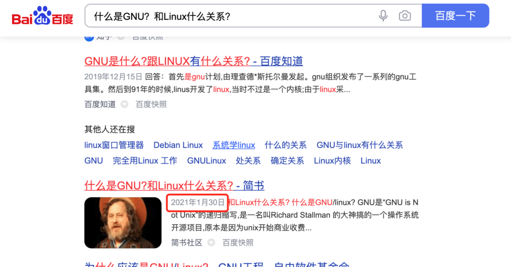
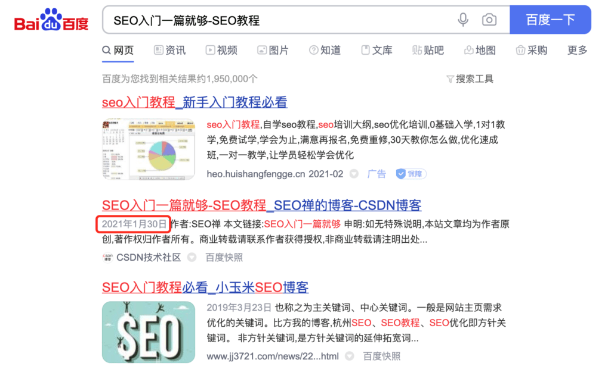
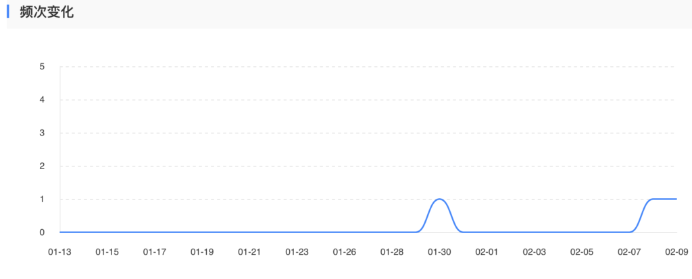

在SEO圈子有句话，“内容为王，外链为皇”，可见对于SEO优化来说，外链的地位是多么重要，但是最近几年有很多不同的声音出现，有的人说外链不重要，没有用了，但是在我看来，这些人往往做的都**低质量外链**，有时候可能是淘宝上几块钱成百上千的低质量外链，这种外链当然是没有用的，反而还会有不好的影响，说了这么多，**那什么是外链**？

## 友情链接不是外链

作为普通站长，可能最直观的理解外链就是**友情链接**，严格来说友情链接并不算外链，这几年SEO行业也慢慢对友情链接的重要程度进行了重新评价，我个人觉得友情链接并不是很重要，不需要花太多的时间在这方面，有些朋友有时候到处去找能交换友链的地方，也不关心行业相关性，对方网站质量，这样往往还容易被搜索引擎惩罚，得不偿失。

## 怎么做网站外链

作为一名合格的SEO从业人员，你必须明白什么是真正的外链，SEO外链的价值是什么，如果不懂做外链是为什么，那还是不要乱做外链，就拿[我](https://www.helloyu.top/seo)来说，从网站上线到现在，已经有差不多一个月的时间，但是迟迟没有被百度收录，也没有蜘蛛来抓取数据，**百度站长平台**后台数据全部都是一条直线，我想这不对啊，谷歌都收录好好的，怎么百度还牛逼了不成？

这可不成我想，我这网站可是**SEO经验**分享，要是自己的收录排名都不行，那不是打脸了么？行吧，既然这样那就去发几条外链引引蜘蛛看看，说干就干，我选取了《2021最新WordPress安装教程（一）：Centos7安装Apache》、《SEO入门一篇就够-SEO教程》、《什么是GNU？和Linux什么关系？》这三篇文章，分别到不同的博客平台发布，有的是做了图片外链，有的是做文字外链，其实才一个月新站新域名没收录很正常，而且还是一个SEO网站，我个人感觉百度对SEO内容的网站有一点偏见，也许是被**黑帽SEO**搞的吧。

放完这些文章，当天就有蜘蛛来爬取数据，放在各平台的文章也被百度秒收录了，比如我1月30日那天发布在**简书**的文章：

还有当天发布在CSDN的文章：

还有另一篇文章发在了博客园，没有被百度收录，但是在第二页发现一个网站采集了我这篇文章：

我估计是没有设置好规则，链接清理的不够干净，还能看到我的链接地址。

虽然只有三篇文章发到了三个不同的高质量平台上，但是当天就有蜘蛛来爬取：

这个结果我是还算满意，现在基本上蜘蛛已经每天都正常来爬取一次，对于这种新站来说，我感觉还是效果不错，接下去就是继续更新高质量的SEO原创文章，有空的话就发发外链，我算是起步了。

以上说了这么多，你可能会觉得我什么也没说，确实我啥也没说，但是也确实说了些东西，虽然标题是写怎么做网站外链，我也没有长篇大论的去介绍怎么做，但是我想我用几张图片应该能说明一些事，**高质量网站外链**对网站优化来说是非常重要的事，这篇算是废话比较多，因为是在喝了些酒，脑子飘飘然的情况下写的，作为赔罪，以后我会多写几篇详细介绍怎么做SEO外链的文章，对不住了各位！
