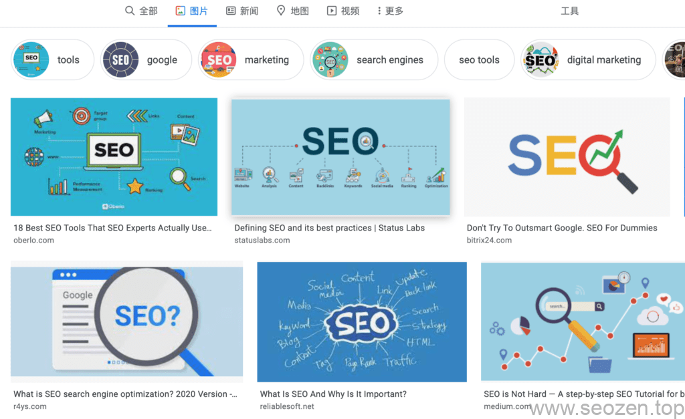

今天我要跟大家聊聊图片中alt属性，不要小看这个图片的alt属性，谷歌对于这个属性还是很器重的，对于提升网站排名也有一定作用，不然谷歌也不会花好几篇文章去说明alt属性，这篇文章我打算把谷歌官方的几篇文章提取出来，来说说图片alt属性以及如何优化。

## 什么是Alt属性?

我们在做这件事之前，首先需要明白为什么做这件事，Alt属性最重要的功能就是在**图片无法显示**，作为替代说明文字，比如在网络不好的时候，图片加载比较慢，首先浏览器就会使用alt属性内的文本作为占位标记显示在网页上，让读者有个大体的概念，这个**图片表达的内容含义**是什么。

## Alt属性的作用

Alt属性不同Title属性和其他说明性属性，这个属性是图片所特有的属性，在其他Html标签上是用不到Alt属性的，所以这个属性有两点很重要的作用：

- 增强网站的用户体验
- 有利于图片SEO优化，提升网站排名

第一点前面我已经说过了，就是在图片无法加载的时候，作为图片辅助说明性文字，第二点是最重要的一点，因为做好Alt优化，能够提升网站排名，获得更多流量，虽然各大搜索引擎在积极发展图片识别技术，但是还是无法做到像人类一样准确理解图片的意思，这时候我们就需要使用**Alt属性**，帮助搜索引擎理解图片，写好Alt属性文本内容，就像写好文章Title一样，能够带来更多的关键词排名，各大搜索引擎都有图片搜索的功能，那些图片就是搜索引擎建立索引，并给予排名的，可以看到那些图片都是有相关信息描述的：



谷歌图片排名描述

## 怎么写好Alt属性

下面我简单举个例子，来说明下什么样的Alt文本内容，才是符合SEO要求；首先来看看最简单的Logo图片标签：

```

```

这是我LOGO的图片属性，可以看到**图片文件名**是有意义的名称，不是随机的字母或者数字，这是第一个要注意的地方，上传图片之前，要尽量重命名图片，让他语义话，之后Alt属性内部，是英文描述的图片功能，表达的是这个图片是我的LOGO，如果是国内不做谷歌排名的朋友，这里用中文就好，我Alt标签一般使用的是英文描述，这是比较好的方式，一般的方式是把图片语义化后的文件名，去掉后缀放到Alt属性里面，这样也是可以的，但是肯定没有**功能描述**的好。

下面在优化Alt属性的时候，有几点需要注意：

- 描述的越详细越好。
- 尽量让描述文本相关性高，言简意赅，不要过长。
- 把文章关键词使用到其中最好。
- 避免关键词堆砌问题。
- 不要用多余的说明文字，比如说『这张图片』。
- 不要忘记form表单中的图片按钮也要加上Alt属性

关于图片Alt属性的知识暂时分享到，我感觉还有很多内容要说，但是还没有想好要怎么表达，有什么不懂或者有什么问题可以评论留言。
