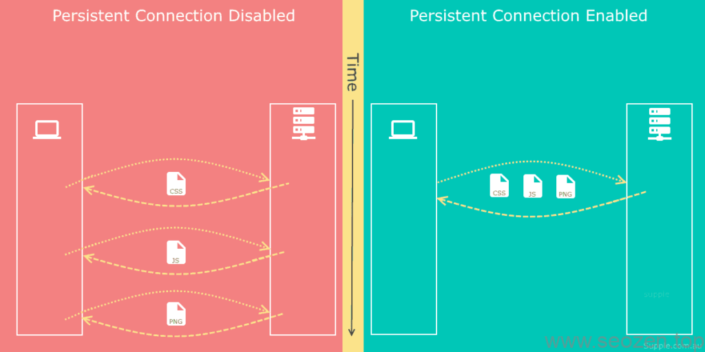
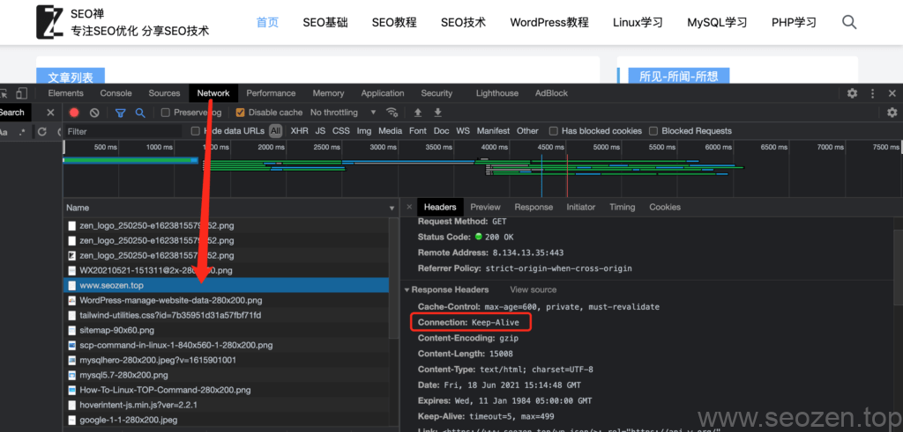
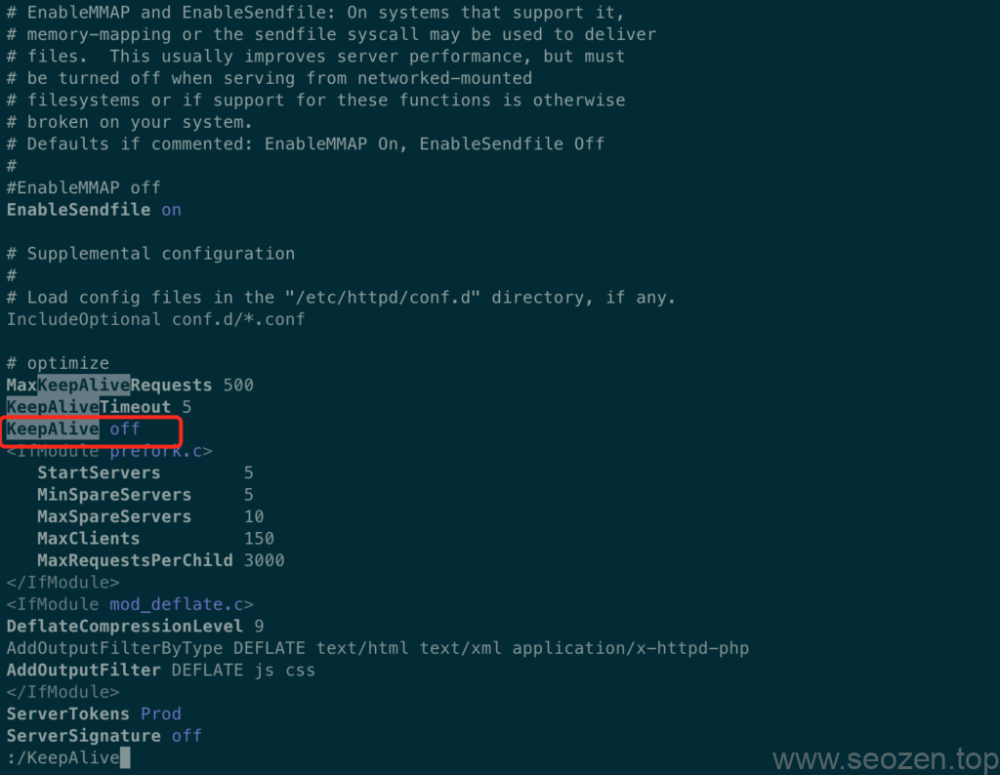

学过计算机网络的同学应该对Http协议比较了解，其中我最深刻的应该是TCP**三次握手**，今天这篇文章虽然不是说TCP协议的三次握手，但是也是有相关性，首先我们来了解下，用户在浏览器输入地址，到网页显示这个过程中，在浏览器中发生了什么？

首先我们的任何网页访问都是基于IP地址，在浏览器上输入的域名，必须先转换成IP地址，所以用户再回车后，第一时间计算机会请求DNS服务器，解析域名的IP地址，得到IP地址后，进行TCP三次握手，建立HTTP连接，之后开始下载相应的资源，流程大概是这样，那跟**SEO优化**又有什么关系呢？其中有一个关键的地方就是建立HTTP连接这个步骤，如果没有进行优化设置，虽然都是同一个服务器，同一个浏览器，每次请求一个资源都需要重新建立HTTP连接，这样不就效率很低吗？我们能不能让一次性请求只建立一次连接呢？答案肯定是有的，就是今天要说的**KeepAlive模式**，下面是打开Keep-Alive功能和没打开的区别：

打开Keep-alive对比

HTTP中的**keep-alive**模式就是为了解决前面说到的问题，一个资源请求后连接就断开，要下载另一个资源就要重新建立连接，服务器设置Keep-Alive支持后，能提高网页的访问速度，可以打开[谷歌浏览器开发者工具](https://www.helloyu.top/seo/developer-tools-network-seo.html)，看看当前服务器是否支持Keep-Alive模式，如果支持，返回头中应该要有如下信息：

谷歌开发者工具Keep-Alive

如果不支持，这个地方应该是`close`，如果是Apache服务器，打开`httpd.conf`配置文件设置下：

/etc/httpd/conf/httpd.conf

把上面的`off`改成`on`就可以了，记得重启下服务器。
