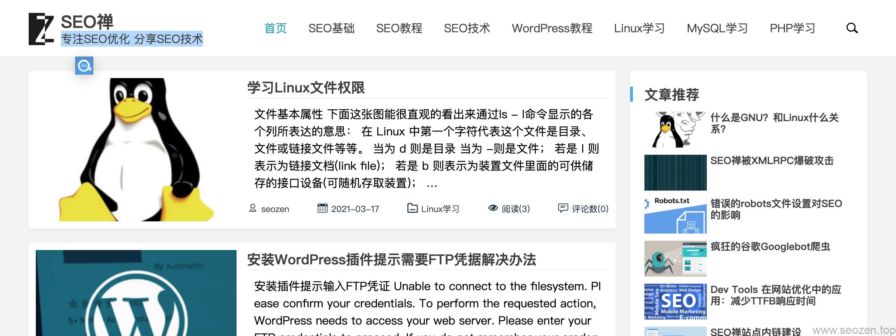

我最开始的一篇文章《SEO入门一篇就够》中就说到，**网站****关键词**是女神，大家都围着她转，在网站进行排名优化的时候，只有把自己的目标关键词做到首页的位置，再谈**客户转化率**才有意义，要是网站都没有流量，一切都是纸上谈兵，现在我分享下网站首页关键词的布局，这篇文章没有提到太多细节，关于具体的实施会在其它文章介绍。

## 头部关键词

以前看过一个报道，说是用户在浏览一个网页的时候，注意力最集中的位置，就是头部左上角区域，撇开这个研究来说，我们观察自身的浏览行为习惯也是差不多的，在这个世界上，我们大多数人都是接收着相同的社会资讯，相同的社会教育，大多数人的行为习惯也都趋向同质化，明白这些那**学习SEO优化**就会容易的多。

回到正题，一般网站左上角放的都是网站LOGO和网站标题，有些人只使用LOGO图标来占居左上角的位置，我个人觉得可以配合上文本形式，这里一般也会有一个超链接指向网站本身。

头部的导航菜单应该来说是整个首页权重仅次于LOGO标题的位置了，所以这个位置一定要选择好目标关键词，目标关键词可以分为**主要关键词**，次要关键词，**长尾关键词**，有时候甚至可以用一些相关的辅助词，因为辅助词有时候会比较容易出排名，能够前期给网站带来启动流量，一个新站最困难的时期就是刚开始的时候，被搜索引擎各种嫌弃。

## 内容关键词

所谓内容关键词，就是除了在头部和底部的关键词，这部份的关键词权重要比头部关键词低，但是有数量优势，我们可以把大部分**次要关键词**，长尾关键词，相关辅助关键词安排在这个位置，但是也要记得合理分布，不要进行无意义的堆砌，可以遵循**28法则**，相关的内容占80%，次要相关辅助性的内容占20%，总体关键词密度的话在2%-8%，等一些竞争低的关键词有排名了，再对竞争大的关键词做一些优化。

## 底部关键词

网站底部一般放着版权申明等信息，所以权重肯定也是最低的，有些SEO朋友喜欢在网站底部做友链，其实我个人认为没必要，而且影响网站美观，因为有些友情链接的名称真的是有点太风骚了。

在网站的底部推荐放一个链接指向回网站首页，也可以布置一些次重要的关键词链接指向网站内部目录。
