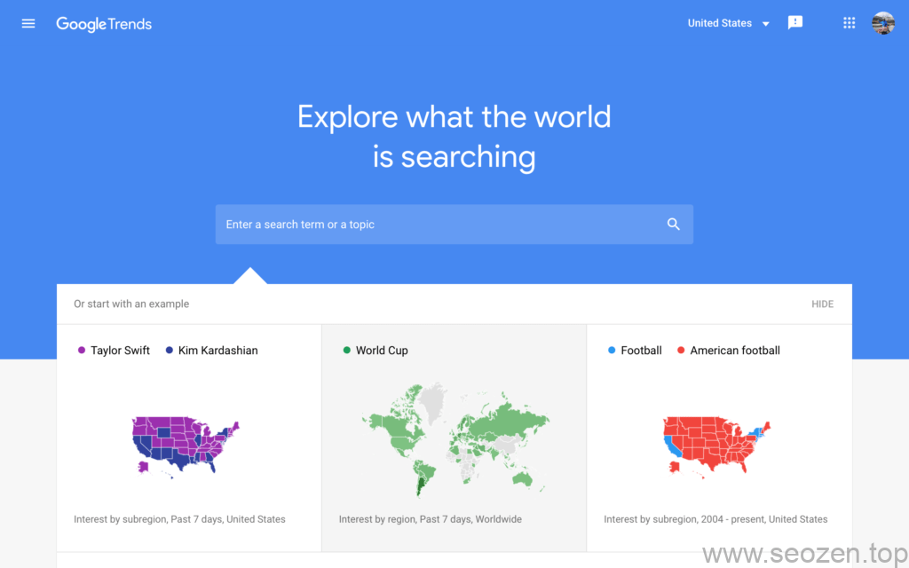
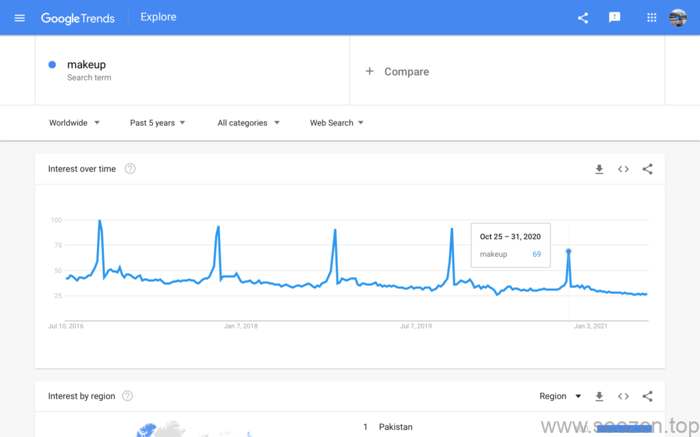
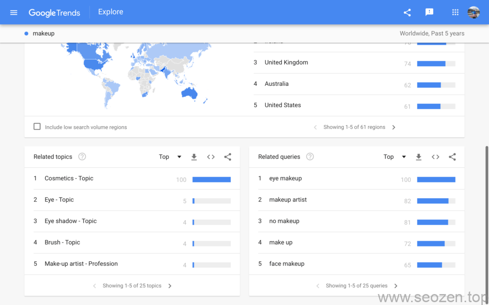
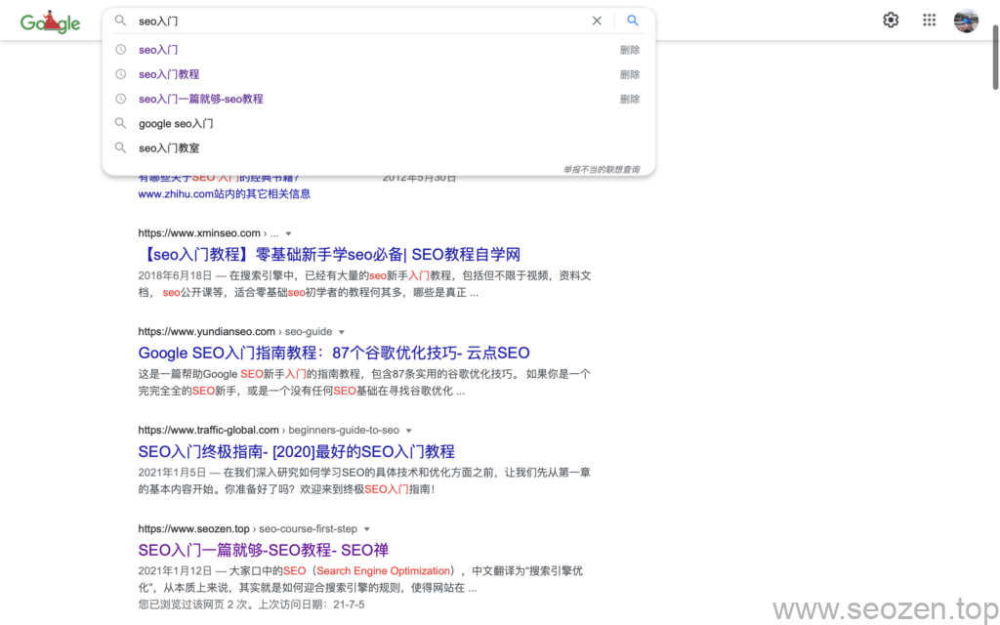
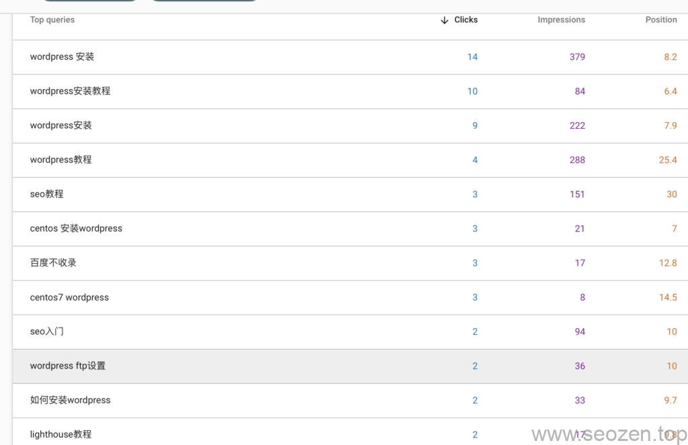

最近我在做安卓项目比较忙，大部分入门理论的文章也写了差不多了，有的也写了一个系列，但是感觉还是不够完善，有很多边边角角的地方感觉也没说清楚，所以还是有必要写一些零散文章去补充说明下，就比如关于**SEO新手入门**的文章，我已经写了下面这些：

- [SEO优化入门一篇就够-SEO教程 - SEO优化](https://www.helloyu.top/seo/seo-course-first-step.html)
- [SEO新手入门系列（一）：SEO金字塔](https://www.helloyu.top/seo/seo-tutorial-moz-serial-2021-outline.html)
- [SEO新手入门系列（二）：SEO 101](https://www.helloyu.top/seo/seo-tutorial-moz-serial-2021-seo101.html)
- [SEO新手入门系列（三）：搜索引擎工作原理](https://www.helloyu.top/seo/seo-tutorial-moz-serial-2021-search-engine-first.html)
- [SEO新手入门系列（四）：搜索引擎相关知识](https://www.helloyu.top/seo/seo-tutorial-moz-serial-2021-spider.html)
- [SEO新手入门系列（五）：挖掘关键词](https://www.helloyu.top/seo/seo-tutorial-moz-serial-2021-keyword-research.html)
- [SEO新手入门系列（六）：站内SEO内容篇](https://www.helloyu.top/seo/seo-tutorial-moz-serial-2021-on-page-content.html)
- [SEO新手入门系列（七）：站内SEO优化](https://www.helloyu.top/seo/seo-tutorial-moz-serial-2021-on-page.html)
- [SEO新手入门系列（八）：SEO技术](https://www.helloyu.top/seo/seo-tutorial-moz-serial-2021-technical-seo.html)

其实**SEO新手入门系列**还没有算完全写完，因为暂时没有头绪继续往下写，朋友们读完这几篇文章应该至少对SEO入门会有一点概念，下面想知道的可能就是具体要怎么操作，这篇文章我要分享**[谷歌SEO优化](https://www.helloyu.top/seo/Google SEO优化-tutorial-starter-guide-2021.html)**方面的内容，在做**SEO排名优化**最关键的一点就是**怎么找关键词**和**长尾关键词**，那接下去就来说说在做谷歌排名优化的时候**如何挖掘关键词**。

## Google Trend

谷歌Trend是官方的关键词挖掘工具，做外贸的朋友一定是很熟悉的，类似**百度指数**，但是比百度指数要好用和功能强大不知道几个级别，使用**谷歌趋势**关键词工具去挖掘中文关键词有点不太准确，毕竟谷歌被我们赶出去了，国内也访问不了，要不是被墙，百度指数真的是没戏，百度不太争气啊！下面是Google Trend的界面截图：

谷歌Trend界面

这里我输入Makeup作为关键词看看有什么结果：

谷歌趋势搜索makeup关键词

从图上面可以看到一个趋势图，左边Y坐标是0-100表示**关键词热度**，X坐标表示时间轴，从图上可以看到，每年的10月30号左右，这个Makeup关键词搜索热度都非常高，为什么呢？因为这几天是**西方万圣节**：

万圣节装扮

不管是大大小小，都肯定会makeup（打扮）起来，往下拉，我们可以看到相关的话题和搜索词，这些都是很好的关键词和长尾关键词：

Google Trend相关话题和搜索关键字

## Google 搜索

定位关键词和长尾关键词，谷歌的下拉搜索框也是一个不错的地方，就比如**[SEO入门](https://www.helloyu.top/seo/seo-course-first-step.html)**这个关键词，我的文章已经被谷歌排到了第6位，作为新站，这个位置我很知足了，说明谷歌和读者其实挺认可我的文章：

SEO入门在谷歌的排名

往下拉，我们可以看到**相关搜索**也有很多可以使用的**[长尾关键词](https://www.helloyu.top/seo/long-tail-keywords.html)**：

谷歌搜索相关长尾关键词

上面这些长尾词都是可以用来作文章标题和文章主题。

## Google Search Console

[谷歌Search Console](https://search.google.com/search-console?resource_id=sc-domain:seozen.top)类似我们的[百度站长平台](https://ziyuan.baidu.com)，但是功能还是要强大的多，之前我有写了一篇[利用谷歌Search Console分析SEO优化方法](https://www.helloyu.top/seo/google-search-console-seo.html)，简单了介绍下**谷歌搜索平台**在SEO优化方面的应用，其实在**Performance面板**，我们也能发现很多有价值的长尾关键词：

谷歌搜索平台展现面板关键词信息

在谷歌挖掘关键词的方法还有不少，这篇文章我就先介绍到这，有什么问题可以留言评论。
