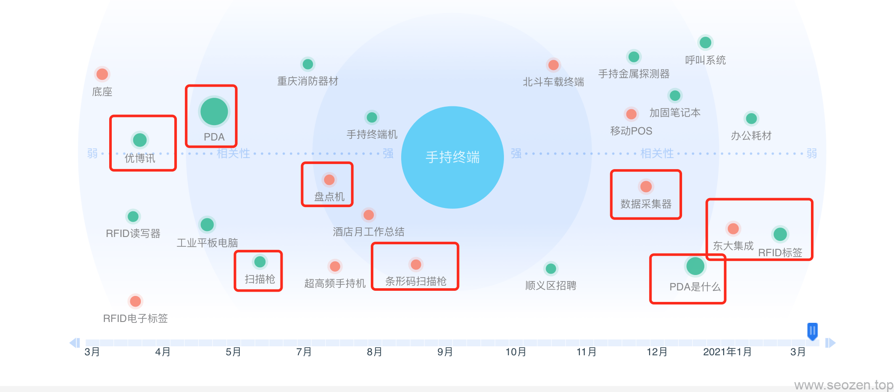
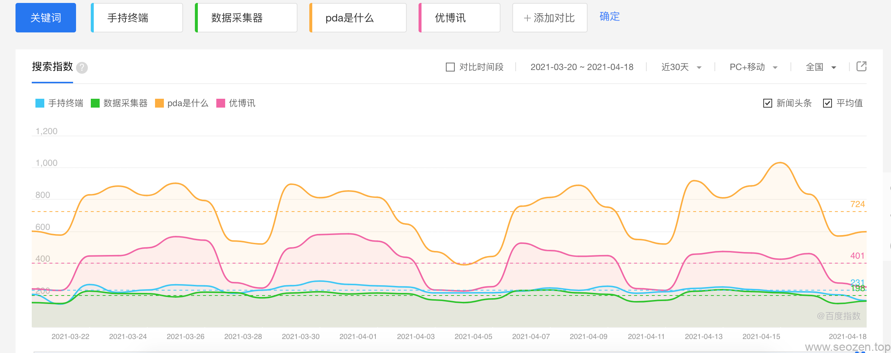

前面已经说完搜索引擎的工作原理，现在就和SEO禅一起来学习下SEO最重要的一部分内容，**SEO关键词**，很多朋友在选择**目标关键词**的时候没有头绪，有时候选的关键词和网站的内容也不合适，导致搜索引擎导流来的用户，发现网站提供的内容并不是他们想找的，这就让网站的**跳失率**变的很高，间接导致网站的搜索权重降低。

## 准备工作

[SEO禅](https://www.seozen.top)为客户网站定位关键词之前，都会做一些准备工作，首先要能够回答下面三个问题：

- 目标用户的搜索内容是什么？
- 有多少的搜索量？
- 这些信息要以什么样的方式呈现给用户？

就拿SEO禅最近的一个客户作举例，这个客户是做PDA数据采集行业的，他们的产品在超市收银，物流入库盘点行业都需要用到，我们平时扫码支付的那个盒子也是他们的主营产品，所以在选定目标关键词之前，我们先研究下上面三个问题。

## 关键词定位

SEO禅和企业客户聊了聊，也看了几个他们竞争对手的网站，研究了下他们的关键词，因为这个行业算是垂直行业，不是大众型的，所以关键词的搜索指数并不是很高，多数目标用户搜索的关键词都是大词，直接搜索特定产品型号的比较少，所以SEO禅给关键词类型作了一个排序：**行业大词>品牌关键词>产品型号关键词>长尾关键词。**

这个时候我们就可以选择一些**种子关键词**，去确定合适的关键词，比如**手持终端**，就是行业大词，我们用这个词到百度指数中搜索看看：

可以看到SEO禅用一些红框框起来的，都是适合的关键词，比如PDA，盘点机，数据采集器，条形码扫描枪这些都是行业大词，而优博讯，东大集成这些是品牌词。我们可以用这些词组成长尾关键词，如：优博讯手持终端，东大集成数据采集器等，或者写一些FAQ文章，比如**PDA是什么**。

## 搜索指数定位

作好关键词定位后，我们要看看各自的关键词有多少搜索指数，比如说上面的几个关键词，我们用百度指数查询下：

在定位关键词指数的时候，记住不要选那些没有流量的关键词，不要自己想哪个关键词好就选哪个，关键词的选择用数据作为支撑是最稳妥的方法。

从上面的图你会发现一个很有意思的现象，可以看到有两个关键词搜索指数成周期变化，而且基本上图形的起伏都差不多，我们在看看下面的时间，基本上是周末最少，从这里我们可能得到一个信息，那就是搜索这些关键词的人，大部份应该是企业客户，所以在做这些关键词的时候，我们就可以定位目标客户群体，提供相应的服务和营销策略。

## 搜索意图定位

每一个使用搜索引擎的用户，在搜索之前，他一定有想要搜索的问题，而且有希望能得到的答案，现在的搜索引擎也越来越智能化，他们在返回搜索结果之前，会试图去分析用户的搜索意图，然后用合适的方式去展现结果内容，谷歌在 [Quality Rater Guidelines](https://static.googleusercontent.com/media/www.google.com/en//insidesearch/howsearchworks/assets/searchqualityevaluatorguidelines.pdf)中描述了这些搜索意图：“know” （获取信息），“do”（完成某个目标），“website”（寻找一个特定网站），“visit-in-person”（浏览本地信息）。

这里的意图分析之后，可以使用谷歌提供的数据结构化工具，具体实现方法不在这篇文章中介绍，之后会写详细的文章来介绍，这算是高级SEO的内容。
