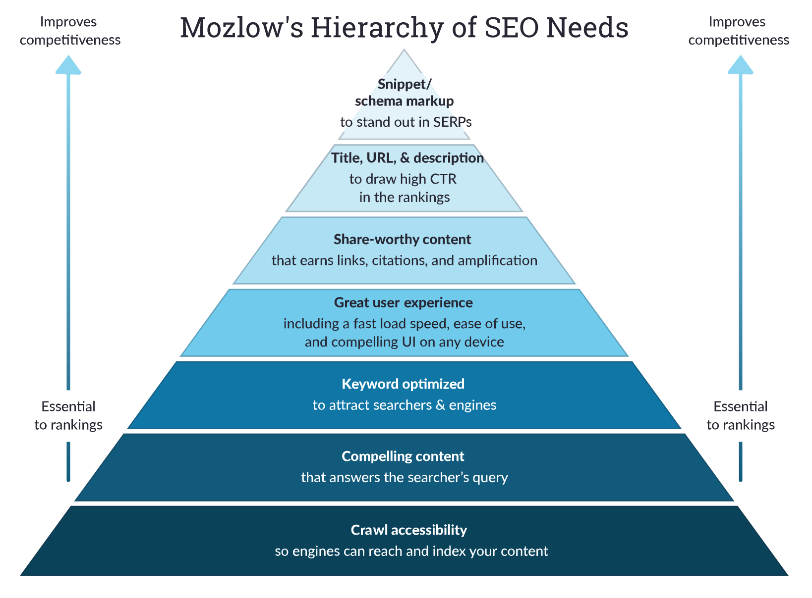
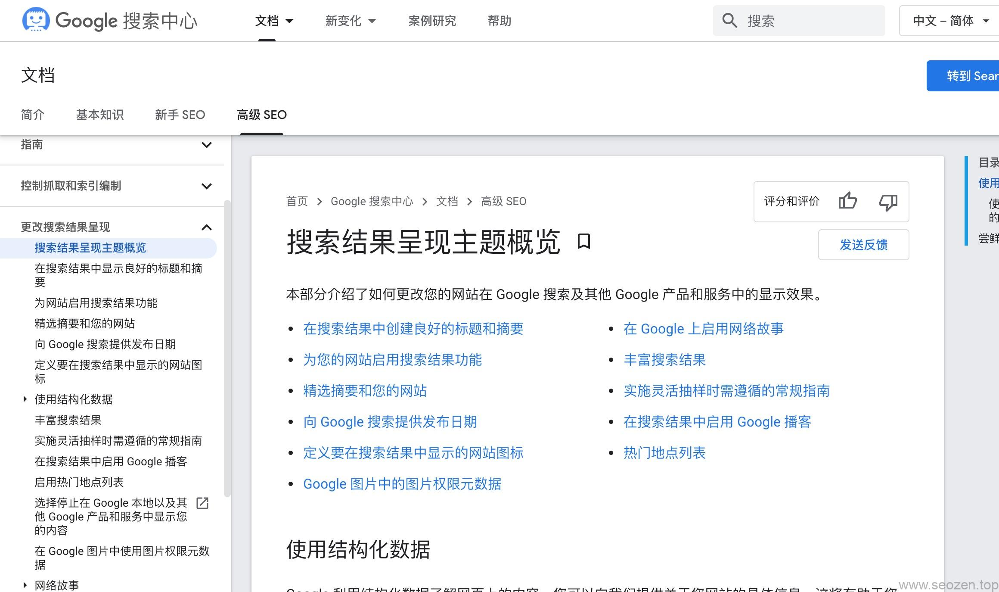

seo禅最近打算翻译一些优秀的[SEO优化](https://www.helloyu.top/seo/seo-course-first-step/)文章，在MOZ上看到**SEO入门**系列，觉得写的不错，所以就打算翻译成中文，希望对**SEO新人**有一定帮助，这个系列文章翻译自：[The Beginner's Guide to SEO](https://moz.com/beginners-guide-to-seo)，如果英文好的同学自己去看看，MOZ这家企业在SEO领域算是做了很久的，所以他分享出来的东西大部分都是干货，从这篇SEO新人教程你大概会学到：如何找关键词，如何让网站对搜索引擎友好，如何建设链接等内容。下面就开始这个系列的教程，我并不是一个字一个字翻译的，文章内容会根据自身经验作删减，可以在文章下方评论留言说说你的想法。

## SEO金字塔法则

这个SEO金字塔法则的原则是，如果你没有做好底层的建设，就无法支持更高一层次的SEO优化，所以想做好SEO，就要把基础知识学好，从底层架构就要做好，为什么做现成的网站优化有时候比新站还难，就是因为旧的网站在架设的时候就没有考虑SEO，如果你代码架构层面没做好搜索引擎优化，那在这基础上做的任何操作都是像过独木桥一样。

对SEO金字塔法则各层做一个简要的介绍：

## SEO爬虫

从上图我们可以看出，要想做好网站排名优化，首先我们要解决的就是金字塔最底层的事，第一件事就是**搜索引擎爬虫**是否可索引，这里关系到几方面内容：

- robots.txt文件规则
- 服务器稳定性
- 网站打开速度

如果是WordPress搭建的网站，还要看看在后台“设置->阅读-> 建议搜索引擎不索引本站点”这个复选框有没有被勾选，正常来说robots.txt文件一般不会禁止搜索引擎抓取，但是有可能设置错误会导致搜索引擎收录下降，前几天我就因为不小心误设置robots文件规则，导致收录量下降，可以看这篇文章《[错误的robots文件设置对SEO的影响](https://www.helloyu.top/seo/robots-mislead-seo/)》了解下那次操作的详细情况，后面改完之后收录慢慢就恢复了。

## SEO内容为王

这句话在SEO领域就是老生常谈，没有优质的内容作为支撑，**SEO网站优化**就是没有灵魂的一件事，有时候你可能会看到一些采集站，垃圾站排名在前面，但是这些站的寿命一般都不长，搜索引擎算法一调整，基本就要上上下下，有的站点就直接挂了，再也爬不起来，所以如果是做**白帽SEO**的朋友，我建议大家还是认认真真一步一个脚印的做原创文章，搜索引擎不傻，现在**AI大数据**，对语义分析的能力越来越强，一篇文章是不是原创，有多少价值，对百度和谷歌这样牛逼的公司来说，基本就是显而易见的事。

有些朋友说不会写文章，其实我写文章就一个原则：**用户想要的就是搜索引擎想要的**！

只要遵循这个原则，写出来的文章就不会差，就像**我**，我并没有做任何形式的推广，也就前一段时间发了几条外链，但是现在基本上每次发新的文章都有了阅读量，在一个月前，新发的文章阅读量基本是零，现在每篇文章的阅读量都在稳定上涨，虽然我还没有把评论打开，但是从阅读量我就能跟踪哪篇文章最多人看，我给自己定的任务是每天写1-2篇的文章，我的文章都是定时任务发的，所以你们看到这篇文章的时候已经不是我写文章的当天，有时候我写的文章自己回头看，就会觉得写的不够到位，我就会相同的话题再写一篇，尽量想把**SEO知识**表达清楚。

## SEO关键词优化

搜索引擎本质上来说就是一个语义解析再加分词的机器，这是最重要的功能，就算抓取了再多的网站数据，没有好的语义解析和分词系统，就无法分析用户真正的搜索意图，要是搜索引擎给不了用户想要的内容，那用户自然不会用这个搜索引擎，就像我们国内，主要的搜索引擎市场还是百度，就是百度在搜索引擎分词方面做的比较优秀，能提供给用户想要的信息，虽然搜索引擎已经很智能，但是如果我们提供了错误的关键词信息，搜索引擎也是无法把我们的网站展现给用户的，所以在做关键词优化的时候，不仅好考虑用户，还要考虑搜索引擎，同时对搜索引擎和用户友好的关键词才是好的**SEO关键词**。

## SEO用户体验

作为网站优化，提升用户体验的方式有很多，最基础的就是网站的打开速度，改善网站打开速度在SEO优化方面来说是比较容易做到的一件事，因为网站打开速度慢一般是由硬件问题造成的，有可能是服务器设置有问题，有可能是服务器硬件配置太低，也有可能是数据库配置文件设置问题，就像我在《[Dev Tools 在网站优化中的应用：减少TTFB响应时间](https://www.helloyu.top/seo/dev-tools-seo-ttfb/)》这篇文章里面介绍的，只改了一个WordPress连接MySQL的配置信息，就把网站打开的速度提升了不少。

如果硬件方面没有什么优化的空间，可以再考虑优化UI界面，或者分析用户行为，来提升网站整体的用户体验，就比如一个网站如果层级太深，用户点击多次才能到自己想要的界面，那这种结构在用户体验方面就还有提升的空间，比如相同的内容可以作成专栏的形式，把相同的内容聚合放到一个大类里面，让用户有更好的体验。

## SEO社交分享

大家在浏览文章的时候一定会发现在一些位置，都有社会化分享的按钮，国内比较常用的就是QQ，WeChat，知乎等平台，把文章内容分享到相关性高的平台，增加曝光量和反链数，如果文章写的不错，分享在这些平台的文章还会被其它平台或者网站转载，当然也会被其它网站采集，这样就有了裂变效果，就像我在《[如何做网站推广-外链为皇](https://www.helloyu.top/seo/website-external-links/)》介绍的，有些网站采集了我发表在其它平台的文章，增加了搜索引擎蜘蛛来访频率，间接增加了网站的收录。

## SEO TKD优化

自从谷歌不使用Keywords字段后，已经有很多站长不再设置keyword信息，我也一样没有设置，以前很流行的TKD优化，现在我觉得应该是`TUD优化`，`U`代表`URL`，每篇文章都应该有一个单独有意义的URL地址，可以是中文，也可以是英文，也可以是拼音，个人比较喜欢使用英文，对于企业站来说，一天最多就几篇文章，不要省那些时间用数字或者一些无意义的URL命名。

## SEO搜索结果页面优化

最后的最后，这里就到SEO金字塔顶端，如果网站做到了首页，其实只有前3位排名分得了大量搜索引擎流量，就算在首页，只要不是前三位排名，获得的流量那是少的可怜，那做到了首页，我们怎么做才能进前三名呢？那就是需要精益求精的精神了，因为一个关键词大家能做到首页位置，基本使用的方法差不多，但是要做到前三位，那只有把细节做好才有可能，现在搜索引擎自然排名结果页(SERPs)中，不只是自然排名，还有一些广告和一些结构化的内容，这部分内容算是SEO高级部分，以后我也会专门写一些文章来介绍。

下面就正式开始这个系列的教程，下一篇内容：《[SEO新手入门系列（二）：SEO 101](../seo-tutorial-moz-serial-2021-seo101/)》，觉得这篇文章对你有帮助或者觉得我哪里没有写好，都可以留言评论。
