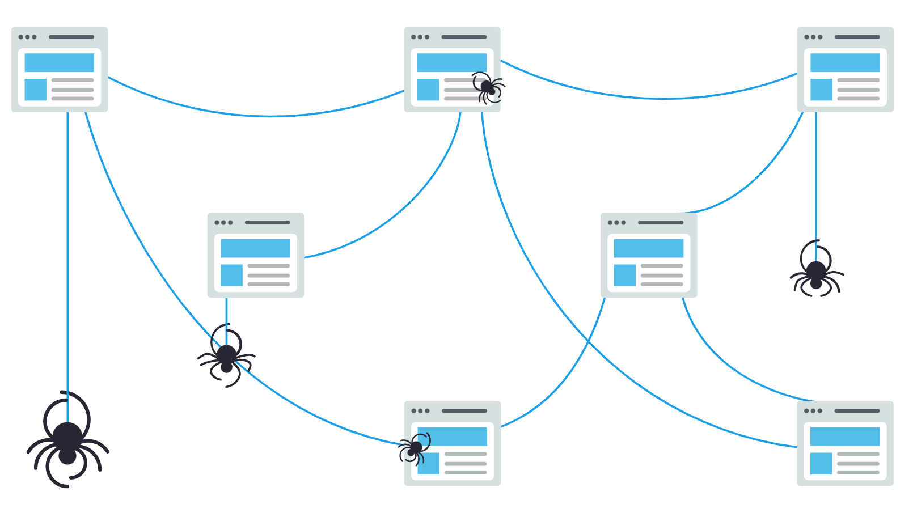
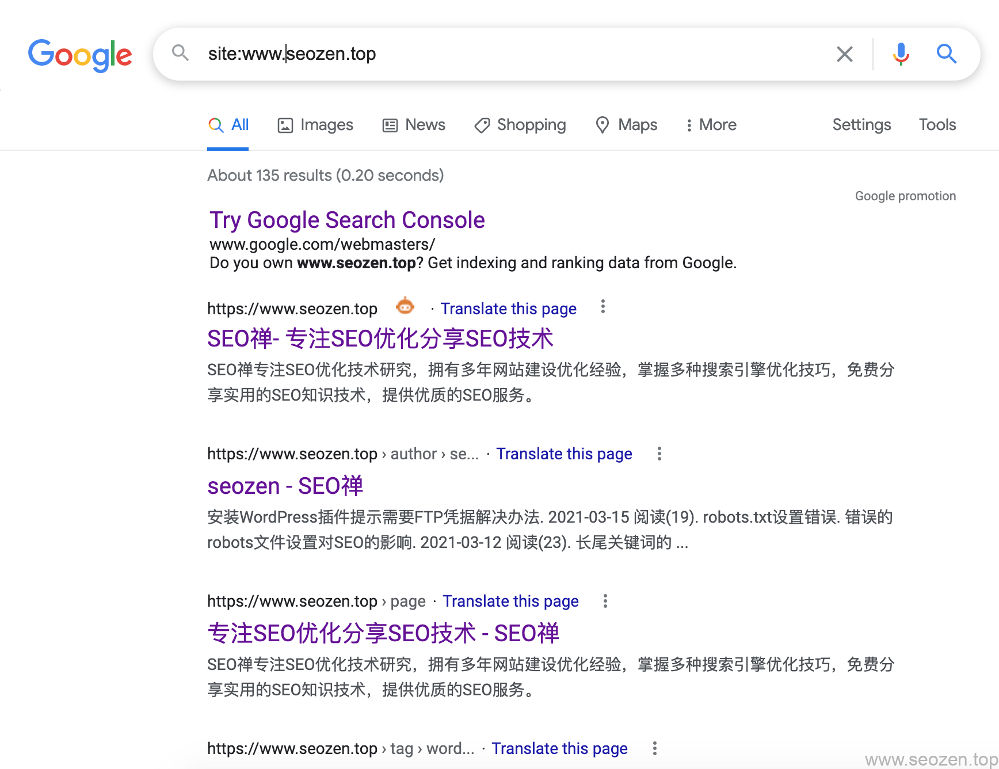

通过《SEO新手入门系列（二）：SEO 101》这篇文章已经简单的介绍了什么是SEO，和搜索引擎，这一篇文章来详细的介绍下搜索引擎的工作原理，搜索引擎的工作顺序大致是：**抓取网页（Crawing）**，**建立索引（Indexing），排名显示（Ranking）**。

就像在前一篇文章提到的，搜索引擎就是一个问答机器，他们去挖掘，理解，组织网上能发现的任何信息，然后把他们以相关的方式组织起来，再返回给使用者，为了能把你的网站展现给用户之前，最重要的一件事就是你的网站能够被搜索引擎发现 ，否则在SEPRs（搜索引擎结果页）是不会有你网站信息的。

## 搜索引擎是怎么工作的？

就如我开头说的，搜索引擎想把网站信息提供给用户，需要完成三个主要任务：

- 爬取网站（Crawing）会有很多蜘蛛程序，顺着URL一个网站一个网站的爬取网站内容。
- 创建索引（Indexing）对蜘蛛爬取的内容进行分类，创建相关索引，并储存在数据库中。
- 建立排名（Ranking）为可能的问题建立相关性排名，相关性最高的内容排在靠前的位置。

当然其中的技术实现是非常复杂的，作一名SEO新人，可能占时不需要深究这些问题，我在大学毕业的时候，作的毕业设计就是搜索引擎，当然那时候是使用第三方的索引分词库，我们大部分时间只要配置规则就可以，更深入的内容我会另写些篇文章来分享。

## 搜索引擎抓取（Crawing）

搜索引擎要想把相关内容展示给用户，第一步做的就是派出他的小弟——**搜索引擎爬虫（蜘蛛）**，他们会不停的抓取互联网上新的内容，或者更新数据库中旧的内容，内容的形式多种多样，有可能是网页，PDF文件，MP3音频文件，什么形式都有，但是他们都是通过URL去找到这些内容的。

 

搜索引擎一开始会有一些种子URL，这些URL都是一些质量比较高的链接地址，而且蜘蛛们就会顺着这些地址不断的往下抓取，在这个过程中，新发现的链接又会被作为新一轮爬取任务的种子URL，直到没有新的链接可以爬取。

## 搜索引擎索引（Indexing）

建立索引是一个非常复杂的过程，这个过程涉及的内容比较多的是计算机方面的内容，有算法，有地理环境，有社会学研究等等因素，搜索引擎会根据很多参数去控制这些内容的分类，但是最重要的一点，就是这些内容的相关性，相关性越高，被分在同一个分类的可能性就越高，建立索引是为了后期能快速展现给用户作准备，也是为排名提供数据基础。

## 搜索引擎排名（Ranking)

用户在搜索引擎输入框输入他的关键词，搜索引擎会用惊人的效率在他庞大的索引数据库中找到相关的内容，并按内容的相关性和一些其它的参数来对内容进行排序，这个过程就是搜索引擎排名，靠前的内容，在搜索引擎看来就是和用户的问题相关性越高的回答。

如果我们不想让搜索引擎把一些内容展示给用户，这也是可以办到的，但是大多数情况下我们不会这么做，搜索引擎优化的目的就是为了让用户看到我们，并能让搜索引擎优先展示我们想给用户看的内容。

## 搜索引擎能找到你么？

就像前面说的，如果要让自己的网站出现在SERPs中，那前提就是让网站被搜索引擎蜘蛛爬取和索引，如果你已经有了网站，你可以使用`site`命令来查看自己网站被收录的情况，就拿我为例，在谷歌搜索框输入`site:www.helloyu.top/seo`你可以看到如下类似的结果：

可以看到我已经有135个网页已经被谷歌收录，这个结果是经常会变动的，能看到一个大概的数据，并不是特别的精准，还有很多没有显示的网页，用一些关键词也是能搜索到。如果想看更精准的结果，可以使用**[Google Search Console](https://www.helloyu.top/seo/google-search-console-seo/)**在收录功能中查看，这就相当于我们**百度的站长平台**，但是我个人觉得比百度站长的作用要大的多，所以我一般只会看GSC的数据，很少去看百度站长平台的数据，以后也会专门写几篇文章来介绍。

如果你使用**site命令**找不到网站的收录，那有可能是下面几种原因：

- 网站是新站，搜索引擎还没有收录。
- 网站没有外部导入链接，可以到一些平台发一些外链。
- 网站目录结构太深，太复杂，让搜索引擎爬虫抓取的效率太低。
- 网站可能包含一些阻止搜索引擎爬虫的代码，如**noindex**，**nofollow**
- 网站可能被搜索引擎处罚，因为一些作弊或者垃圾广告等。

我们有时候把精力太多的放在如何让搜索引擎抓取内容，却忽略如何不让搜索引擎不要爬取一些内容，比如说一些重复的页面，一些搜索参数，还有比如说公司的联系方式，留言等，这些内容被收录意义并不大，而且还会让搜索引擎不知道具体哪个界面是你最想展示给用户的，所以这时候我们就要告诉搜索引擎，哪些资源他不要花时间去爬取，这就要`robots.txt`文件出场了，这篇SEO教程先到这，下篇文章继续接下去讲《SEO新手入门系列（四）：搜索引擎相关知识》。
