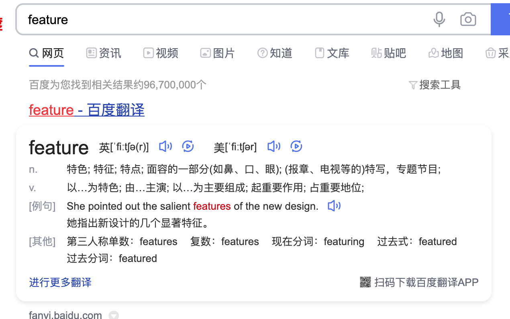

这是《SEO新手入门系列教程》的第二篇文章，一看标题就应该清楚这篇文章讲的是**SEO基础知识**，没有任何高大上的东西，如果对SEO基本概念有了解的朋友可以跳过不需要看，但是如果你是半路出家的SEOer，我还是建议系统的学习下SEO，知识只有系统化的学习，才能融会贯通的使用。

## 什么是SEO

对于新人来说，第一件事肯定是在搜索引擎搜索【SEO】这三个大写的英文单词缩写是什么意思，SEO禅第一次接触SEO的时候差不多都是在初中，那时候应该是SEO最火热流行的时候，各种各样的SEO文章都有，SEO是**search engine optimization**的编写，中文意思是**搜索引擎优化**，他和他的兄弟SEM很像，SEO禅给他们简单的定义区分，SEO比较倾向于使用自然手段去获得**搜索引擎自然流量**，**SEM（搜索引擎营销）**比较偏向使用商业手段来获得搜索引擎流量。

SEO的思想就是：理解用户搜索行为，满足用户的搜索需要。更细分一点就是，了解用户所搜索的关键词，提供用户和搜索引擎想要的内容，如果说了解用户所需是硬币的一面，那如何把他们需要的内容呈现给用户和搜索引擎那就是硬币的另一面。

## 搜索引擎基本概念

搜索引擎就像一部**问答机器**，你输入什么问题，他就会给你一些答案，这些答案哪里来的呢？都是搜索引擎从网络上找来的，这里很关键的步骤就是，抓取和索引，搜索引擎会派出很多他的小弟（搜索引擎蜘蛛）,无休止的爬取网络上任何可以爬取的信息（网页，PDF，图片，视频，文件等），最后通过一些方法分类建立相应的索引，之后依赖这些数据对每一个相关网页设置一个类似权重的概念，权重排名越高，在返回给用户的时候会优先显示，排列在前面。这就是搜索引擎工作的机制，实际过程要复杂的多，但是基本过程是一样的：爬取内容，索引分类，排名展现。

## 搜索引擎自然流量

前面说过SEO和SEM的区别就是流量获取的方式，**网站排名优化**就是为了获取搜索引擎的自然流量，在以前获取自然流量相对于现在要容易的多，现在各大搜索引擎为了第一时间能让用户得到他们想要的内容，对**SERPs（搜索结果页）**作了较大的改动，很大一部分自然流量被搜索引擎推出的**富媒体搜索**和**第0位结果展示**分走了，像百家号，百度地图，谷歌图片，这些排名基本都在自然排名第一名的前一个位置，我们称这个位置为第0位，比如百度翻译如下照片：

这对于用户来说是非常方便的，但是对于SEO来说，就是雪上加霜的事，所以这几年做SEO的人越来越少，入这一行的人越来越少，不是说这个行业不行了，而是现在的门槛要高的多，SEO方式也在不断的变化，不再是单一的网站优化，学习好SEO知识，对于从事网络营销相关行业是非常有帮助的。

这篇文章已经讲了SEO的基础，大家看到这里应该有一些基本的概念，可以接下去看看《[SEO新手入门系列（三）：搜索引擎工作原理](https://www.seozen.top/seo-tutorial-moz-serial-2021-search-engine-first.html)》。
