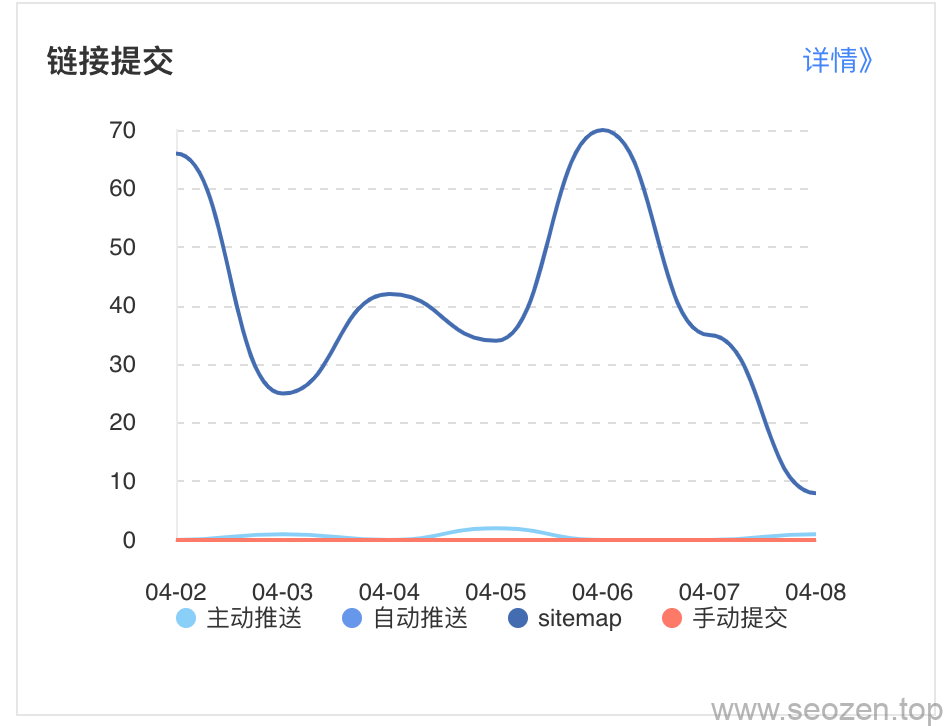

这是《SEO新手入门系列系列》的第四篇内容，前面一篇已经把搜索引擎的工作原理作了简单的介绍，可能看过我以前文章的朋友会发现，有些内容其实是已经写过的，但是为什么还要再写呢？其实我也有想过这个问题，有时一篇文章写一个知识点的时候，并不会很全面，即使很多篇文章写相同的知识点，也不一定会有重复，可以用不同的角度去写，有时候写着写着就会发现新的想法，这篇文章又继续写到搜索引擎爬虫，但是我尽量用不同角度去描述，如果有相似的内容就会少写点，直接附上链接，可以自己去看看。

## Robots.txt

如果要说到**搜索引擎蜘蛛**，那肯定不能不提`robots.txt`，因为 Search Engine Spider (搜索引擎爬虫)来到网站第一件事就是去访问这个文件，下面有几点需要注意的地方：

- robots.txt文件是大小写敏感的，不要写成Robots.txt或者robots.TXT，这样都是不行的
- 这个文件必须放在**网站根目录**下
- 不要把一些后台管理登录界面放在这个文件内，因为这个文件是谁都可以访问的
- 可以把sitemap的地址放在这个文件内最底部的位置
- 不是所有搜索引擎爬虫都会遵守这个“君子协定的”
- 二级域名如subdomain.example.com都需要放置自己独立的robots.txt文件

使用robots.txt文件对于SEO来说是最基础的一步，也是最重要的一步，怎么重要？要是设置不好真的会让搜索引擎不收录你的网站的，不信的可以看看我前一段时间写的《[错误的robots文件设置对SEO的影响](https://www.helloyu.top/seo/robots-mislead-seo/)》，就是因为错误设置了robots规则，导致搜索引擎收录下降，还好只是设置错了一个规则，如果搜索引擎读取了错误的robots.txt文件，那很有可能整个网站就不收录了，可以看看《[robots.txt文件介绍](https://www.helloyu.top/seo/robots-seo/)》学习下robots文件的书写规则。

## sitemap文件

sitemap.xml和robots.txt是直接和搜索引擎蜘蛛打交道的两个文件，sitemap主要告诉搜索引擎网站有哪些页面，robots主要告诉搜索引擎哪些网页不能访问，可以看看《[Sitemap的作用是什么-SEO基础](https://www.helloyu.top/seo/what-sitemap-is/)》学习下怎么写sitemap文件，我比较懒，使用的是wordpress插件生成的，再配合搜索引擎自动提交代码。

## 蜘蛛行为分析

前面已经说过robots.txt文件的重要性，下面我给大家分析下蜘蛛的行为，搜索引擎的蜘蛛和现实的蜘蛛很像，他们都是顺着自己的网爬，而搜索引擎蜘蛛的网就是URL地址，我们的网站内部，就是要把这个网做好，让蜘蛛能顺利的抓取每一个重要的网页，我在很多文章中提过，蜘蛛来到我们网站，都会有一个**固定的时间**，不可能无限制的爬取，我们要尽量把网页结构安排合理，像我这种个人博客，从内容页到主页，一般就是3层结构，目录树太深，蜘蛛很难一次爬完，现在市面上的网站大多都是这种层级，只要经过鼠标的两次点击，一般就能找到内容页。

其实还有很多琐碎的内容，但是不打算写在这篇文章，以后会专门写一篇来介绍一些其它细节。
