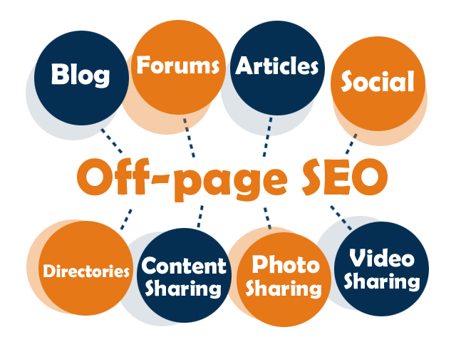

SEO新人在刚接手网站优化项目的时候，往往无从下手，因为了解的太少，经验也不足，有时候会避重就轻，今天我要来拉个清单，列出大部分在[SEO优化](https://www.helloyu.top/seo/seo-course-first-step/)过程中需要注意的点，在进行搜索引擎优化的时候有方案可以参考，就像一张待完成清单，可以参考参考，检查下有什么项目做了，有什么项目没做。

## 站内优化

SEO站内优化

### TDK标签

检查每个页面是否有独立的TDK标签，每个页面的标题和描述尽量不要重复，尤其是需要排名的界面，描述最好的手写，把关键词安排进去。

### 关键词优化

首页核心关键词3-5个，其他长尾关键词安排到内容页，尽量把长尾关键词库给做大，这样流量慢慢会成几何形式增长，关键词密度要注意，不要堆砌关键词。

### 内容原创性

网站内容这是SEO优化的核心区域，首先要保证大量内容的原创性，一篇文章至少要500字以上，内容过少搜索引擎会直接认为是低质量文章，一个网站太多这样的内容，搜索引擎就不会给好排名，在[输出优质原创文章](https://www.helloyu.top/seo/writing-seo-article/)的时候，一定要把关键词和长尾关键词合理的布局和应用在其中。

### 内链优化

网站其实就像一张蜘蛛网，各个方向都能访问到，这样才有利于蜘蛛抓取，只有把网站内链优化成一张精致的蜘蛛网，搜索引擎才能更好的收录网站和给予更好的排名，不要有孤立的页面存在，如果不想要收录特定的页面或者目录，使用robots.txt文件或者nofollow屏蔽。

### 网站结构深度

正常网站结构不要超过3层，遵循3次点击原则，就是在网站首页开始，经过三次鼠标点击，能到达内容页，如果页面过深，直接影响蜘蛛抓取效率，不利于搜索引擎收录网站内容，尤其是新站，一定要控制好网站结构深度，等有稳定蜘蛛抓取，再加深是可以的。

### 网站访问速度

网站访问速度是很重要的一项SEO指标，谷歌搜索引擎明确指出，网站的打开速度是作为SEO排名的参考依据，保证网站打开速度在3秒之内，如果想获得更好的排名，要保证打开速度在一秒左右，尽可能使用**懒加载**，服务器文本压缩，**图片优化压缩**等技术。

### 网站地图

查看网站是否有自动生成的网站地图，注意这个地图要自动生成，手工更新的等于是没有，每个站长平台都有后台提交地址，这个地址只要提交一次就可以，搜索引擎爬虫都会经常去更新这个网站地图，看看网站上有什么信息没有抓取到。

### 图片alt属性

图片的alt属性主要是为了在图片无法加载，显示的一个占位提示文字，主要是给文本阅读器使用，但是各大搜索引擎都把这个属性作为一个高质量站点的判断依据，编写合适的[alt图片文字](https://www.helloyu.top/seo/seo-image-alt/(opens in a new tab))是网站站长的必修课。

### 面包屑导航

谷歌的Search Console中还有专门的一项，用来统计网站面包屑导航页面，所以**面包屑导航**不管是再用户体验，还是在网站排名优化中都是有比较重要的作用。

### H标签

我们在写文章的时候，要合理的安排文章结构，不要一个标签用到底，文章一定是有中心思想的，然后有各个小标题去支撑这个中心，在HTML上有很多标签，比如说B标签，Strong标签，这些都是可以在创作的时候使用的，合理的使用H标签能让文章各加容易读懂，对于搜索引擎来说，也更好理解文章内容。

### URL语义化

URL地址的语义化低于用户来说不是特别重要，但是对于搜索引擎来说是有作用的，如果一个网站每篇文章基本都能使用人类可以读懂的URL地址，说明这个网站不像是机器采集来的，内容应该也是经过人工编写，这样间接的会给搜索引擎一个好的印象，使得搜索引擎给予更多的权重。

### 页面静态化

现在大部分的网页都是动态生成的，很少只使用HTML静态页作为企业网站，但是在搜索引擎眼里，只有静态的内容它才认识，所以让动态页面伪静态化对**搜索引擎给予更高排名权重**是有影响的，网站URL地址变成静态页结尾地址，如`/`。

### 是否有404页面

一个网站在找不到要访问的内容，返回的页面应该是人工处理过的404页面，如果直接返回服务器的404界面，这样的用户体验是非常糟糕的，搜索引擎肯定也考虑到这点，如果一个网站都没有返回合适的404页面，那这个网站应该不会是一个高质量的站点。

### 301重定向

网站一般有带www和不带www的域名，不带www的是主域名，但是大多数人输入的都是带www的网站地址，所以我们要考虑是把带www跳转到不带www，还是不带3w跳转到带3w的地址，有点晕？没关系，只要知道为什么要做301跳转？其实选哪一个域名都可以，做301跳转主要是把权重传递到同一个域名上就行。

### JS代码跳转

网站导航链接如果使用JS代码跳转，将会严重影响各大搜索引擎收录，我前段时间有个客户，网站就使用JS跳转，5年的老网站，收录就个位数，这个在[网站建设](https://www.helloyu.top/seo/wordpress)的时候就要留心。

### 排查robots.txt文件

所有正常的搜索引擎，进网站第一件事就是访问根目录下的robots.txt文件，之后参考[robots.txt文件规则](https://www.helloyu.top/seo/robots-seo/)访问网站，如果robots.txt文件规则设置错误，那直接影响网站收录，甚至可能不收录的情况，排查robots.txt文件规则是否设置正确很重要。

## 站外优化

SEO站外优化

站外优化需要注意的主要是外链的质量和推广渠道，下面列出一些主要的推广渠道：

- 微信公众号
- QQ群
- QQ空间
- 今日头条
- 知乎
- 豆瓣
- 小红书
- 百度贴吧
- 百度知道
- 百度文库
- 百度百科
- 新浪微博
- B站
- 优酷
- 新闻源类网站
- 同城类网站
- 网址目录类网站
- Youtube
- Instagram
- Pinterest
- Facebook
- Twitter
- Quora
- Reddit

站外优化是站内优化锦上添花，不是雪中送炭，只有把站内优化做好，配合站外优化才能起到效果，不然可能还会有副作用，今天的这篇SEO文章就分享到这，有什么不懂得给我留言评论。
