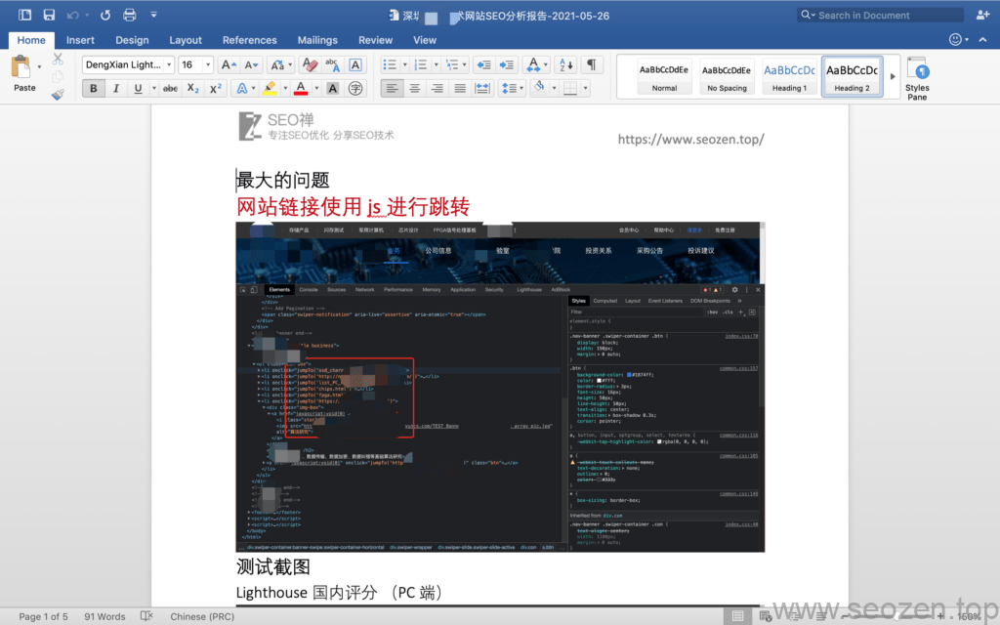
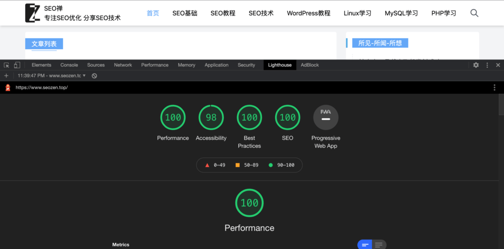

一般SEO优化内容分为：**整站优化**和**关键词优化**，我在和别人谈合作的时候，第一个推荐的就是整站优化，因为只有网站从底层代码到网站关键字布局再到内容，这样全面的进行优化，才能最终达到获取更多**搜索引擎自然流量**和**提高转化率**的目的，有些客户喜欢问一个关键字优化到首页要多久，要多少钱这种问题，会这样问的客户首先是对SEO这个行业不了解，一般做**关键字优化**的基本上都是使用[**黑帽SEO快排**](https://www.helloyu.top/seo/black-seo-quick-ranking-tech-2021.html)，有的客户说一周两周能不能优化到首页，正常来说，百度指数在**100以下**的是可能的，这里还是用的可能，并不能百分百能优化到首页，如果使用正常的**白帽SEO手段**，指数在**500以上**的**SEO关键词**，基本需要3个月左右或者以上的时间；从我发布[SEO优化入门篇](https://www.helloyu.top/seo/seo-course-first-step.html)到现在已经有5个月的时间，这五个月，虽然我不是全职在做**SEO排名优化**的工作，但是看到网站流量一点一点的上涨，感觉还是很有成就感的，至少表明使用的**SEO方法**基本都是正确的，估计百度的观察期也差不多要过了，希望在百度能有个好的排名吧，今天就和大家分享下我在做整站优化的思路。

## 网站源代码

我作为一名程序员，最喜欢第一步从代码入手，有时候最大的问题就是**网站基础代码**的问题导致网站没有排名收录，就比如前一段时间一个我的客户，5年的网站，收入就个位数，使用[谷歌开发者工具](https://www.helloyu.top/seo/developer-tools-network-seo.html)一看，好家伙！跳转全站用**JS代码**，网站是做的很漂亮，这简直就是要了老命，之后给客户出了个简单的报告指出了这个问题：



我客户SEO优化报告

遇到这样的问题只能说是非常非常的不应该，这公司的领导可能是一点**SEO知识**都没有，也不是技术出身；通过这么一个案例可能说明不了太多，但是我遇到的很多案例都表明了，网站排名收录不理想，其实是**网站基础结构**，**网站代码问题**，地基先打好，才能盖高楼大厦！

## 定位关键词

如果网站的基础没有太大问题，我们第二步就要看看关键词的选择有没有什么问题，关键词大致分为两类：**核心关键词**和[**长尾关键词**](https://www.helloyu.top/seo/long-tail-keywords.html)，核心关键词一般都比较短，就三五个字组成，长尾关键词一般都是词组，往往需要进行**整站优化的客户**，他们的关键词也是需要优化的，这里就涉及到[如何挖掘关键词](https://www.helloyu.top/seo/seo-tutorial-moz-serial-2021-keyword-research.html)，还有如何进行[网站关键词布局](https://www.helloyu.top/seo/seo-keywords-position.html)的问题。

## 网站加载速度

可以毫不夸张的说，网站的打开速度直接影响网站排名，[我第二次改版](https://www.helloyu.top/seo/seozen-website-new-version-2021.html)，现在的打开速度要比第一版快的多，虽然第二版的代码量要多的多，我作为一个技术型SEOer，有很多[SEO优化工具](https://www.helloyu.top/seo/dev-tools-seo-ttfb.html)和方法去提高网站的加载速度，这是我和别的SEOer最大区别的地方，下面是我站点第二版使用[lighthouse测试工具](https://www.helloyu.top/seo/google-lighthouse-seo-tool.html)测试的**SEO结果**：



SEO新版Lighthouse测试得分

## 网站TD标签

我从建站开始，就没有使用`keyword`的**`meta`标签**，只给网站加了**Title和Description标签**，当然每个人想法不一样，有些SEOer还是会加上**关键词Meta标签**的，这里要注意的就是每个栏目页都需要有自己独立的**标题Title**和**描述Description**，文章页一般就是选文章的标题，和文章的摘要，但是也要唯一的，不要重复。

## 网站Meta标签

检查TD标签的时候，就顺便检查下有没有一些有利于**SEO排名优化**的Meta标签，比如说[Canoninal标签](https://www.helloyu.top/seo/seo-canonical.html)，[OG标签](https://www.helloyu.top/seo/open-graph-tags.html)，或者**JSON-LD结构化标签**，其中有个很重要的Meta标签，那就是移动适配的标签，现在都在推崇**移动端优先**原则，比如如下的两个移动适配标签：

```
<meta name="viewport" content="width=device-width, initial-scale=1, shrink-to-fit=no">
<meta name="applicable-device" content="pc,mobile">
```

## 网站URL地址优化

作为企业站来说，一般很少说每天会发很多文章，这时候就可以把URL设置成有意义的单词或者拼音，这样也是有利于[网站排名优化](https://www.helloyu.top/seo/网站排名SEO-ranking-how-to.html)的，这时候就会涉及到网站静态化的问题，一般的网站都是伪静态的，所以需要Apache重写规则的配合，来达到**URL地址静态化**，也就是后缀使用`html`或者直接是`\`结尾，只要不是动态语言文件名结尾就可以，这样会给搜索引擎更好的印象。

## 网站301重定向

[我](https://www.helloyu.top/seo/)在把网站架设好的第一件事就是给网站做了[**301重定向https**](https://www.helloyu.top/seo/301-https-seo.html)，让所有不带`www`的域名**全站301跳转**到**`https://www.helloyu.top/seo`**这个域名地址，虽然进行SSL认证，会让服务器解析速度变慢，但是安全性提高了，而且谷歌和百度都明确提出有SSL认证的网站，会给予更多的权重。

## Robots.txt文件规则

**robots.txt**文件可以算是整个网站最不起眼的地方，经常会遗漏，不写规则可能有时候还更好，有些客户的**[robots协议规则](https://www.helloyu.top/seo/robots-seo.html)**写错了，直接导致搜索引擎不收录，前一段时间我还[错误设置robots.txt文件](https://www.helloyu.top/seo/robots-mislead-seo.html)，导致谷歌收录下降。

## 支持面包屑导航

谷歌[Google Search Console](https://www.helloyu.top/seo/google-search-console-seo.html)面板，还专门有一项是标识统计网站有面包屑导航的页面数，说明谷歌对于网站是否有**面包屑导航功能**还是比较重视的，SEO需要做的就是迎合搜索引擎和用户的喜好，不断优化网站。

当然上面提到的只是其中的一部分，每个人的**SEO优化方法**都不一样，我的方法分享给大家只能作为借鉴和参考，其他有什么问题可以留言评论。
