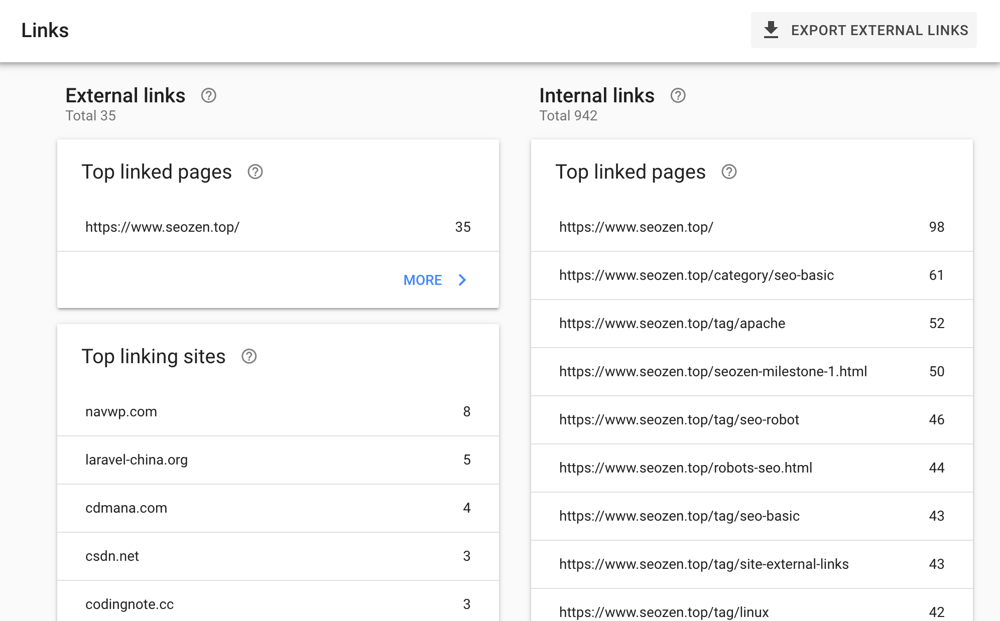

前几天和朋友聊天问我：

> 做我这个网站有什么意义？已经都有非常多SEO教程网站了，而且现在百度在打击这一块，你觉得你的这个网站排名能上的去么？

我当然知道有很多做SEO推广的网站，我也是从小白走过来的，但是我发现大多数那些网站说的都是理论的东西，并没有实际的操作，有很多文章也是搬来搬去，会浪费很多小白的时间，让他们走很多弯路，我这个网站就是检验实践SEO优化的最好证明，看看用我知道的SEO知识能让这个站点达到什么样的水平，我一直都说我并不是大神，就只是过了小白阶段，我也会犯错，但是我愿意把自己知道的东西说出来，让别人去看，如果我说的不对，也可以批评指正，今天我就跟大家分享下以我为例，怎么做网站推广，怎么发**站外链接**？

## 站外单向链接

首先看张Google Search Console的Links图

前一段时间我做了外链，只在4个平台发过推广文章，从谷歌的Search Console可以看到有35个外链指向了我，去除重复后有14个站点，这只是谷歌的数据，实际数据肯定不止这么多，因为我在百度搜索了下，有很多网站采集了我发布在博客园的一篇文章《[2021最新WordPress安装教程（一）：Centos7安装Apache](https://www.cnblogs.com/seozen/p/wordpress-apache-setup-2021.html)》

只是现在我还在百度的观察期，没有排名，上面这些网站采集的文章有的把导入链接给清除了，有的还留着，有的还有图片链接，所以百度蜘蛛还是会有机会爬到**我**来的，这些链接在网站推广里面是最好的一种，这种链接叫**单向链接**（或导入链接），虽然有些站点质量并不是很好，但是可以丰富外链数量，百度也不傻，一个正常网站如果导入链接都是权重非常高的站点，那肯定是人为故意操作的，**百度绿萝算法**肯定有考虑到这点，我们做站外推广的时候要考虑外链的丰富性，高低权重的单向链接都要有，但是还是要以相关性作为指导原则。

## 网站外链类型

前面已经说了单向链接网站要丰富多样，其实我们的外链类型也一样要多样化，不能单一使用锚文本的方式，我们经常使用的站外推广外链有下面4种类型：

1. 锚文本<a href="https://www.helloyu.top/seo" >seo禅</a>
2. 超链接<a href="https://www.helloyu.top/seo" >https://www.helloyu.top/seo</a>
3. 纯文本链接https://www.helloyu.top/seo
4. 图片链接

其中锚文本的比重最大，超链接和锚文本差不多，但是如果要做关键词优化就需要使用锚文本的方式，一篇推广文章，单向链接数最好控制在3-5个以内，而且要语义化的插入，不要影响阅读体验，还有记得最好不要在一篇文章里使用上面所有4种类型，可以挑2-3种方式去发站外链接。

## 内容为王

想要利用外链**提升网站排名，**前提是需要高质量的内容去作支撑，所谓“高楼大厦平地起，打好地基是关键”，就像我前段时间做的站外推广，我并没有花多少时间，我只是把文章写好，把事情说清楚，文章自然就被其它网站采集转载了，这样带来的就是自然的流量，对于新站来说，做外链就是为了引**搜索引擎爬虫**来爬网站，提高收录，有了收录你才可能有排名，有了排名你才可以去考虑做其它的事。

有朋友对写文章这事很头痛，我一开始也是这样，不知道写什么，也不知道这文章写的质量好不好，搜索引擎会给多少权重，其实不用担心那么多，写好文章都是有规律可循的，首先是文章的标题要选好，其次就是文章的内容要突出文章标题所要表达的内容，还有就是内容结构，使用标签辅助说明等，可以看看我之前写的《[输出优质原创文章](https://www.helloyu.top/seo/writing-seo-article.html)》这篇文章，简单的入个门，再就是多看多写，自然慢慢的就会写好，今天的分享就到这，回头再见，C U!
