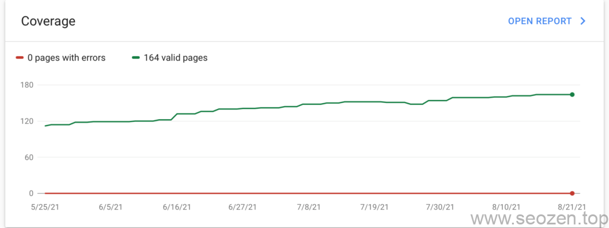
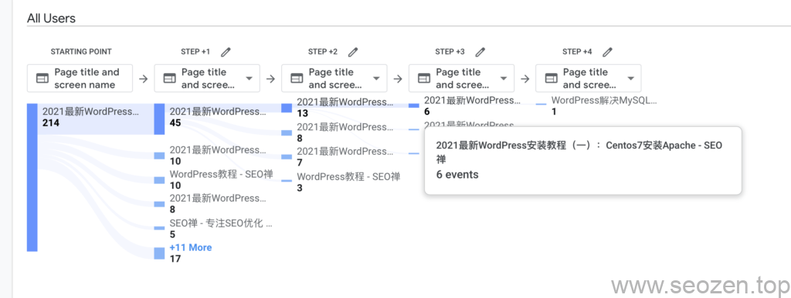

如何做**网站排名优化**？SEO禅已经写了很多文章从侧面来讲怎么做**网站排名优化**，这篇文章主要梳理下总体的思路，也是为了做这个**[长尾关键词](https://www.seozen.top/long-tail-keywords.html)**，**网站排名怎么做**的排名，没错，这篇文章的长尾关键词就是副标题中的提问句式。

## 新站排名怎么做？

新站和老站排名优化的方法肯定是不一样的，这里分开来说，新站在上线之前，尽量要把网站做好后再上线，避免上线之后有较大的结构改动，关键词也不适合作大的调整，这些在上线之前就应该要把框架定好，如果要调整也是进行微调，一段时间调整一点，不要一下全变，当然如果是刚上线的新站，调整幅度大点问题不是特别大，因为这时候搜索引擎蜘蛛可能也才刚来，抓取数据也不勤快，影响并不是特别大，如果有收录了，调整就要谨慎。

### 新站不收录怎么办？

如果上线一段时间后，百度或者谷歌都没有收录，那最好还是先排查下是不是网站哪里有问题，可以看看[新站百度没有收录](https://www.seozen.top/baidu-index-seo-bad.html)这篇文章，看看是不是有类似的问题，现在百度的观察期对于个人站点延长了不少，要是企业站点会好很多，就比如说SEO禅这个网站，百度蜘蛛也很勤快，但是就是不放更多的收录出来，最主要的原因应该是百度对SEO类型的站点已经做了更严格限制，因为有很多黑帽SEO的手段把百度搞得很无奈，SEO禅在谷歌的排名还不错，现在每天正常流量IP都在30-60左右，因为有好几个关键词排名在首页，所以流量还算稳定[SEO禅站点谷歌SEO优化排名情况分析](https://www.seozen.top/seozen-google-ranking-july.html)这篇文章有列出几个关键词，各位朋友也可以自己搜索看看这些关键词是不是在靠前的位置，**SEO优化**这个关键词，截止到今天已经排到了19位，半个月前还是46位左右，已经达到了初期设定的目标，排名进前20。

### 新站排名的具体做法

因为SEO禅已经写了很多篇怎么做SEO排名的文章，这里不具体讲，就把文章链接列出来，然后简单说明下，各位自己可以到相应文章看看。

如果是新手站长，SEO禅建议先看看[SEO新手入门系列](https://www.seozen.top/seo-tutorial-moz-serial-2021-outline.html)文章，对SEO优化有个系统性的了解，入门级的SEO优化知识点并不多，也分成了好几篇文章来讲，这里SEO禅要跟大家讲讲，经常你会在网络上看到很多文章说，一篇文章要写1500字以上，文章内容一定要长，字数一定要够，词不达意也没关系，可以看到SEO禅的网站文章大部分并不是特别长，除非确实知识点没办法细分，不然一篇文章SEO禅觉得最合理的字数在500-1500左右，这是根据人类的阅读习惯和理解力去分的，基本上1500左右字数能够在5分钟内读完，这是SEO知识能被吸收最高效的时间段，如果太长，就会有厌烦的情绪，那为什么很多文章很长呢？主要是为了增加用户在页面的停留时间，这就是文章尽量要写长的背后原因，其实需要把握个度，如果太长，那知识点讲的就会很啰嗦，比如SEO禅现在在说的这个知识点，就一句话就可以说完，那就是尽量写出有营养的内容，增加用户停留时间，但是SEO禅还是写了一大段啰嗦的话。

学习完SEO入门知识，之后就要掌握一些文章的写作技巧和搜索引擎的相关优化技巧，可以看看下面这些文章：

- [SEO优化：输出优质原创文章](https://www.seozen.top/writing-seo-article.html)
- [2021谷歌SEO优化入门：Google SEO优化方法](https://www.seozen.top/Google SEO优化-tutorial-starter-guide-2021.html)
- [OG标签是什么？](https://www.seozen.top/open-graph-tags.html)
- [robots.txt文件介绍](https://www.seozen.top/robots-seo.html)
- [Sitemap的作用是什么-SEO基础](https://www.seozen.top/what-sitemap-is.html)

## 老站排名优化怎么做？

老站排名优化的做法和新站排名优化的做法有一点区别，老站一般不需要去考虑搜索引擎蜘蛛来不来的问题，老站更需要关心的可能是收录时效，收录稳定性，排名稳定性等问题，经常看到一些老站，域名5年左右，收录少的可怜，或者是说收录不稳定上下跳动，如果是使用正常手法的白帽[SEO优化](https://www.seozen.top/seo-course-first-step.html)方法，基本上收录和排名是比较稳定的，就像SEO禅在谷歌的收录，基本就是稳定上升的：

SEO禅谷歌收录趋势

如果出现上下波动很厉害，基本上就是内容质量不高，很多采集站就是这种情况，有的波动几次就直接被K了，收录归零。

老站想提升网站排名的方法有很多，但是首先要把收录和排名稳定下来，刚开始排名靠后没有关系，可以通过慢慢的去调整，让排名往前靠，也不要拼命的输出低质量的文章，做长尾关键词是需要数量，但是如果每篇文章排名都靠后，那用处也不大，做一个长尾词，就尽量把这个词做到靠前的位置，如果每篇文章质量都不错，以后网站整体的权重就会很高，想上哪个词都会比较容易，就像SEO禅，文章并不是很多，但是基本上想做哪个词到首页，并不是很困难，搜索引擎的反馈速度也很快，这里说下为什么能达到这个效果。

首先网站内容的相关性，比如SEO禅主要以SEO优化分享为主，那70%左右的内容就应该说SEO方面的知识，其他30%可以是相关性的内容，比如说[WordPress安装教程](https://www.seozen.top/seo-course-first-step.html)，当然这个还不够，这样做只能让搜索引擎知道，你这网站主要的内容是什么，那怎么才能让排名靠前？这个还需要让用户来告诉搜索引擎，比如WordPress安装这个关键词所对应的页面的用户路径图：

WordPress安装GA用户路径

这张图是Google Analytics（GA）的用户路径图，可以看到有214个用户访问了[2021最新WordPress安装教程（四）：搭建WordPress网站](https://www.seozen.top/wordpress-install-2021.html)页面，之后有95个用户又访问了和这个主题相关的页面，说明用户对这系列的文章感兴趣，有需要他们才会继续阅读，WordPress安装教程SEO禅分成了4篇文章去讲，当然也可以写成一篇长篇文章，但是SEO禅认为这样不利于学习和消化知识点，虽然单页的停留时间和权重有可能会降低，但是相关页的权重就会比较平均，网站整体的权重也会比较平均，就像我们搞天猫运营，爆款当然好，但不是每个店每个产品都能搞爆款，最稳妥的办法就是让整体的权重提高，后期再单独优化特定的关键词和文章。

具体的优化方法还有很多，以后会慢慢介绍，SEO禅觉得一篇文章有一两个知识点，能够完全消化吸收和理解就已经不错了，贪多嚼不烂，SEO优化是一门综合化能力需要比较多的行业，并不是只是简单发发外链，发发文章就行，SEO禅基本就没发过几个外链，除了最初引蜘蛛的时候发了几篇，现在也很少发，不是说外链不重要，如果SEO禅想让特定关键词排名靠前，肯定需要去辅助的发外链，但是现在并没有特别想做的词，基本上几个大词已经在谷歌首页，做长尾词的话，其实很多都是废话，就是为了做排名而做，朋友要是看到这的话，已经算很给SEO禅面子，因为这篇文章废话不少，就是为了**网站排名优化怎么做**这个长尾关键词做排名，才说了这么多废话，这篇文章就说到这，有什么想问的记得留言评论。
