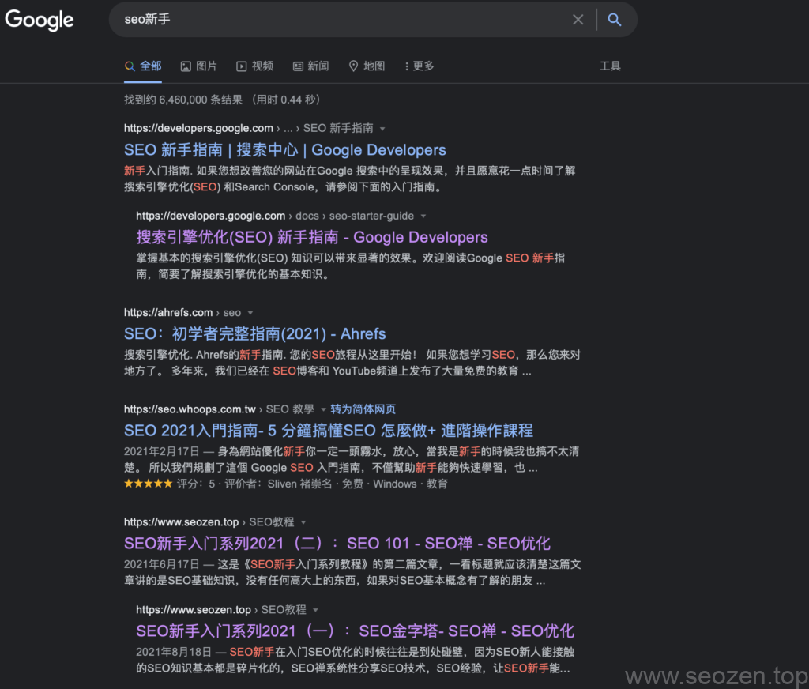

SEO禅早都想写一篇关于如何优化文章标题的文章，一直没有机会排上日程，正好8月，谷歌对文章标题的生成方式作了变更，现在[谷歌更新了文章标题生成方式](https://developers.google.com/search/blog/2021/08/update-to-generating-page-titles)，SEO禅第一时间注意到了这个变化，正好也写一篇文章来说说这事。



SEO新手入门文章标题谷歌修改

从上面可以看到，SEO禅的两篇文章后面都跟了SEO优化这个关键词，注意这个不是SEO禅自己添加的，这是谷歌分析页面后自动生成的，前段时间SEO禅有写一篇文章记录SEO优化这个关键词的优化情况：[SEO禅站点谷歌SEO优化排名情况分析](https://www.seozen.top/seozen-google-ranking-july.html)，里面记录了一个月时间SEO优化关键词从没有排名到排名第二页，纯白帽的优化手法，这种速度对于SEO禅这种新站，更新又不是很勤快，效果是出乎意料的，SEO禅自己都没想到会这么快，那和谷歌自动生成文章标题有什么关系呢？

SEO禅认为谷歌分析文章内容后，会提取出文章中重点的关键词内容加到标题上，所以这两篇文章里面有SEO优化这个关键词，这样我们就可以利用谷歌这个更新特性，把这个关键词权重导向需要排名的页面，提高相应页面的排名，谷歌标题更新的改动就说到这，下面说说如何写出符合SEO标准的文章标题。

## 什么是title标签

如果你是一名前端程序员，`title`标签肯定知道是什么，如果你是新手站长，那个可能对**title标签**还不熟悉，在网页源代码中，title标签如下形式：

```
<title>SEO优化：文章title标题标签优化的奥秘-实例讲解（谷歌最新调整） - SEO禅</title>
```

这个标题内容，一般是网站自动生成的，网站所有的title标签都需要唯一，不能有重复。

## title标签的作用

title标签主要的两个作用是：

- 说明网站，文章内容主题
- 帮助网站关键词获得排名

我们在写一篇文章的时候，最重要的目的是吸引用户访问，一篇文章如果能获得多个关键词用户的访问，说明这篇文章在这些关键词中排名都很不错。

## 如何优化文章标题

上面我们说了什么是title标签和title标签的作用，下面就来说说如何优化title标签，首先要明白一点，title标签不是一成不变的，都是根据需要一段时间一段时间作出调整，这个调整的依据是什么？下面会介绍到。

### 关键词文章标题

通常我们是根据需要排名的关键词去定文章的标题，文章的标题长度保持在50个字符左右，如果是中文的话，保持在10-20字符以内比较好，大概可以安排2-3个关键词，切忌关键词不要堆砌和无脑重复，首先要符合语义，标题要通顺，没有语病，就拿这篇文章标题举例：

《SEO优化：文章title标题标签优化的奥秘-实例讲解（谷歌最新调整））》

首先开头是SEO优化，这个关键词作为第一关键词，SEO禅是为了以后作SEO优化专题做准备，也是提升全站SEO优化关键词排名权重，当然需要有个度，不要每篇文章都加，不相关内容的文章也不要加，不然容易过度优化，被搜索引擎处罚。

其次是『文章title标题标签优化的奥秘』，其中**文章优化**，**文章标题优化**，**文章标签优化**，**title标题优化**，**title标签优化**，都是搜索引擎可能分词的次关键词和长尾关键词，这里虽然短短几个字，搜索引擎就可能切分出多种组合，『实例讲解（谷歌最新调整）』都是为了提升点击效果的辅助词。

### 权威性文章标题

上面已经介绍了一种文章标题的优化方法，这里要介绍另外一种，『权威性标题』，什么是权威性标题呢？这种标题会让人觉得文章内容很有可信度，比如说SEO禅下面两篇文章：

[SEO优化：6个方法提升网站排名](https://www.seozen.top/seo-6-way-improve-website-ranking.html)

[网站排名SEO优化方案（2021最新）](https://www.seozen.top/seo-website-ranking-checklist.html)

第一个标题使用了数字，明确指出6个提升网站排名的方法，大家一定经常在网络上看到这类型的文章标题，第二个标题没有使用明确数字，但是使用了『优化方案』字眼，这也是权威性的语言文字。

### 夸张博眼球型文章标题

这种文章标题不用SEO禅多介绍了，现在网络上大部分新闻类，娱乐类，甚至IT类的文章都开始使用这类标题，这就是抓住人类好奇心的心理，SEO禅觉得这类标题有一些哗众取宠的感觉，所以SEO禅自己本身不会使用这类文章标题，SEO禅分享的是SEO优化知识和编程相关的文章，这些知识类的文章并不适合太多的夸大和博人眼球，这些文章标题现在慢慢已经内卷严重，迟早有一天用户会对这些标题比较反感。

如何优化好文章的标题，最重要的一点就是突出文章内容主题，抓住用户的心理需求，这篇文章就先分享到这，有什么疑问可以留言评论，SEO禅的评论模块已经加上了邮箱通知功能，默认会发送评论通知。
