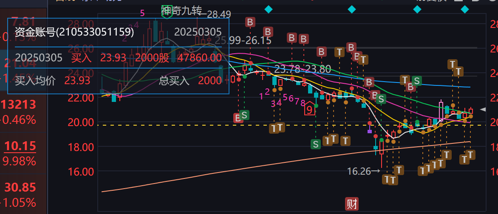
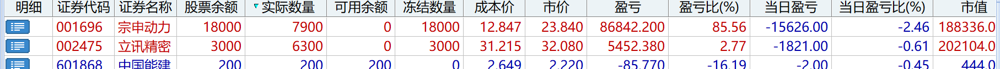
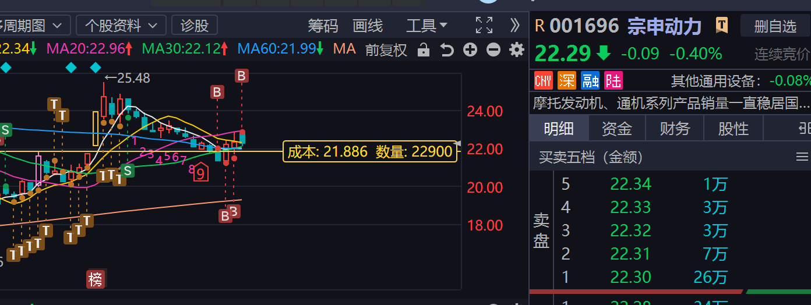
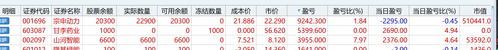
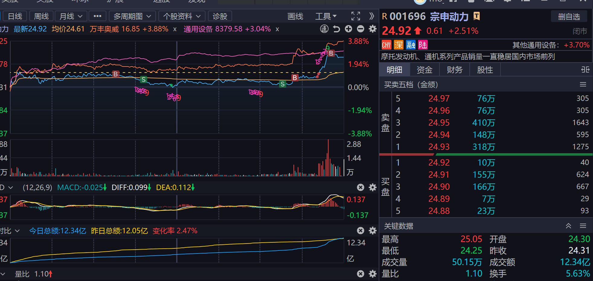

大半夜的睡不着，就起来写写股票日记算了，人上了30以后，身体是一天不如一天，睡眠也是一天不如一天，每天都是在人生倒计时，所以要更加珍惜。
我现在重仓`宗申动力`这支股票，前面买入的时候没想太多，就觉得低空经济这个概念应该还有戏，买入的位置在23块左右：

通过不断地加仓和做T，现在的成本在19.7毛左右，暂时浮盈2w7左右，下面是通过DS生成的一个表格数据：
### 宗申动力（001696）股票分析表  

| 指标         | 数据                              | 更新日期   |
| ------------ | --------------------------------- | ---------- |
| 股票名称     | 宗申动力                          | 2025-05-05 |
| 股票代码     | 001696.SZ                         | -          |
| 最新股价     | 21.03元                           | 2025-04-30 |
| 当前市值     | 232.21亿元（A股总市值）           | 2025-03-31 |
| 市盈率（PE） | 静态PE 50.31倍 / 2025E PE 38.50倍 | 2025-04-30 |
| 市净率（PB） | 2.52倍                            | 2025-03-31 |
| ROE          | 8.14%（2024年）                   | 2025-04-21 |
| 股东人数     | 28.90万户（较上期+19.48%）        | 2025-03-31 |
| 毛利率       | 13.58%（2024年）                  | 2025-04-10 |
| 负债率       | 有息负债率19.56%                  | 2025-04-25 |
| 机构评级     | 华创证券“增持”，目标PE 33倍       | 2025-04-29 |
| 板块热点     | 低空经济/通用机械/新能源          | -          |
<!--more-->

能涨到多少钱我确实不知道，我现在也不去预测市场，只作跟随交易，就当前图形来看，还是算比较弱势，6号开盘要是没有大单拉升放量，就要考虑减仓了，如果有大单拉升3-5个点以上，可以进行高抛低吸做T，继续保持底仓不动，看是否能到25元左右。
## 为什么还继续持有？
从之前亏3w多4w，到现在赚3w左右，为什么还继续持有？有如下几个原因：
 - 第一我觉得宗申动力发布出来的业绩还行，有盈利能力，虽然利润不高
 - 第二宗申动力这个票大概率不会退市，被套了可以加仓做T解套
 - 第三有航发和新能源的业务在开展，估计还会有一些预期，能拉升股价

当然最重要的原因，应该是没有明显走坏，如果后面走势不及预期，应该会在回撤不大的情况下去清仓，低空经济这个概念，不像半导体和机器人容量那么大，但是调整了这么久，可能还是有反弹的可能性的，虽然宗申涨的慢了点，但是风险个人感觉不高，所以就再继续持有看看，后面有什么操作会及时来这边更新。
## 2025-05-09

昨天格局了下，今天利润回撤，不及预期，出掉2/3，看看周一情况，如果还是不给力，就全部出掉，赚了8w多可以了，准备去做立讯精密。
## 2025-06-03
前两天又买回来了，应该是差不多调整结束，看这两天反馈，早上高开以后没有先出掉一部分，因为周末乌克兰无人机袭击了俄罗斯的空军基地，炸了不少战略轰战机，但是主力没有顺势高开拉上去，而是往下炸，估计是在试盘，应该不是出货，下午看看走势决定是出一点还是如何操作。

最近小资金玩了点短线的票，战果还算不错，继续保持节奏。

## 2025-08-15
8月真的是运气不太好的一个月，第一天就亏损2w，后面可能心态有点不太好，买了就跌，卖了就涨，老是追涨，没有遵守交易纪律，这两天又把老伙子宗申动力买回来，这两天走势心态差点崩了，尾盘低空经济有异动，不知道周末有没有利好，希望能挽回一点这个月损失。

正常来说拉尾盘第二天都没好事，但是今天是周五，拉了尾盘还有放量，按理来说是有利好，就看这周末，低空经济也很久没有行情了，宗申除了5月最高点25.28以为，应该基本是没有压力了，如果突破25.28应该会一路去到28块，后面应该是有机会突破35。