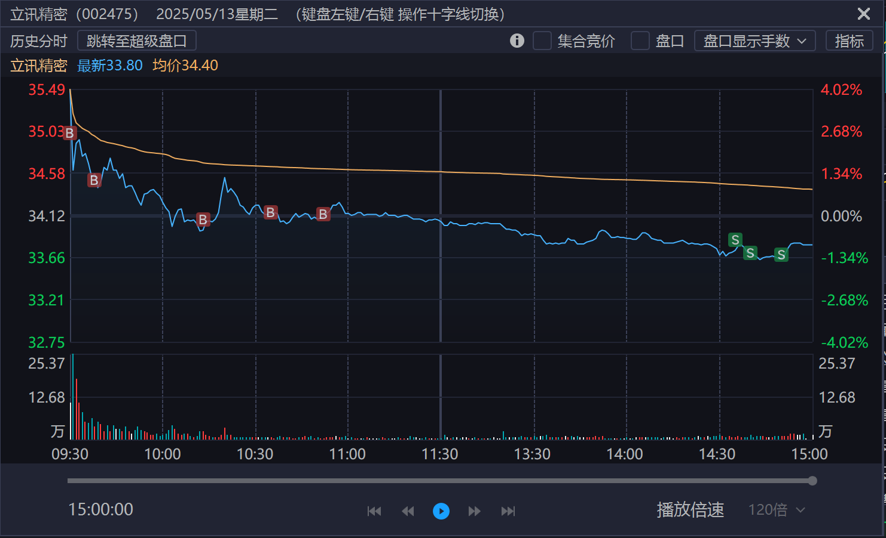

今天本来要涨停的行情，交易突然卡了3分钟，直接就跳水了，歌尔股份也是一样的交易曲线，都卡住了：

我在盘中4次加仓，尾盘也没有卖，我相信晚上应该有什么利好消息，格局下，明天拭目以待。
<!--more-->
## 2025-05-19
12号晚上中美公布的关税利好，但是13号早上开盘不及预期，才高开4个点，心存侥幸没有卖，还不断地加仓，这个就是知行不合一，利润回撤了不少。

今天19号，还是没管住手，下跌过程就买了，应该要等到9点40或者10点半左右再考虑买，下次要记住，下午慢慢拉起来了，明天可能有资金愿意去做多，立讯大问题应用没有，就是涨的太慢了，到目前为止亏1个点，这个月利润回撤5个点，以后不符合预期，还是应该要选择卖掉比较好。

## 2025-05-22

今天开盘就清仓了，从赚3w到亏1w，不及预期，没有资金进来做多，估计还要跌，所以果断清仓，准备休息一段时间，拿点小资金玩玩短线，暂时不重仓了，等大盘站稳3400，或者下来调整以后再买。