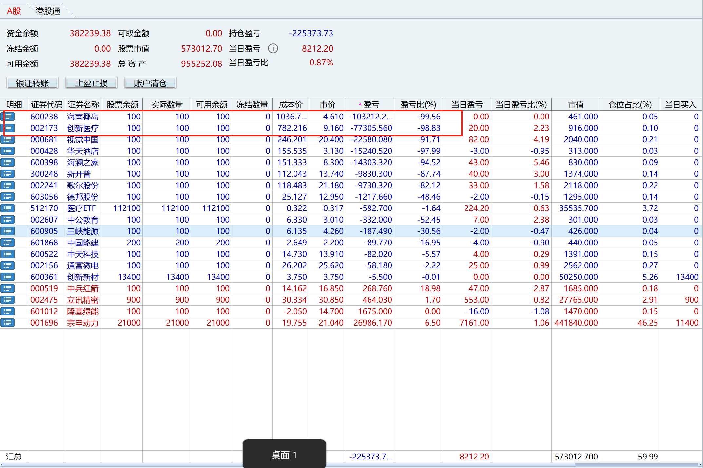

从两年前开始慢慢接触股票，越来越发现这是可以当做一件终身的工作或事业去做，虽然现在还亏着20w左右，但是明显能感觉在这附近开始上上下下，心态也越来越问题，交易纪律也比之前遵守的更好，想把在股市中观察和感悟的一些东西记录下，发现现在的股市软件都没有很好的这个功能，无论是同花顺，东方财富，通达信等我都使用了一段时间，各自都有各自的功能和特点，但是在记录这块不是很好，索性就把自己很久没使用的个人Blog当作记录的地方，以后好给自己作回顾，也可能对别的朋友有一定的参考作用（无论是正向还是负向，也许几年以后我能在股票上赚不少，也许可能亏不少）
## 活下去

<!--more-->
过去两年我主要的亏损，主要是`海南椰岛`和`创新医疗`这两个票贡献的，为什么会在这两个票上亏损这么多，主要原因就是下跌过程加仓导致，而且在没有企稳的时候加仓，也没有怎么做T，还有在不及预期的情况下，没有割肉，还幻想着很快会涨回来，海南椰岛是一路下杀，基本一浪低过一浪，现在的我，第一不会做这种票，第二，不及预期我就会割肉走人，这两年我一直都在摸索，没有去跟着别人去打板，也看到朋友打板赚过钱，但是我也知道他们大多数情况下都是亏钱的，我现在深信，你要吃这碗饭，吃的慢点，长久点才是第一要务，就像人，你只有身体健康，活得久点，钱才有意义。
## 相信国运
最近最热闹的事情就是中美关税战，从个人观察结果来看，美国已经是黔驴技穷，既然把关税当做儿戏，不断加码，跟玩一样，我们这代人，我相信能见证很多历史，我也深信在未来，我们回顾这些事情，也只是沙漠中的一粒沙子，微不足道，我也坚信中国将会从新回到历史的舞台中央，也能像美国，印度这些国家一样，金融市场越来越开放，总有一天一潭死水会变成汪洋大海，我们只要成为那条小鱼，向大海游去，成为一条大鱼，驰骋在无边无际的股海中！