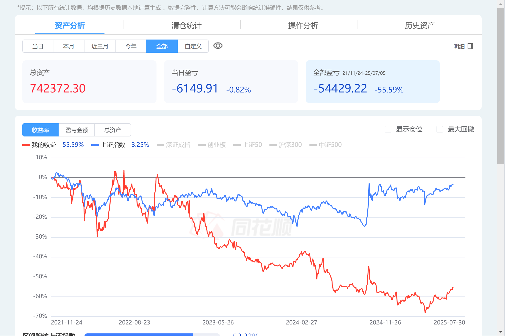
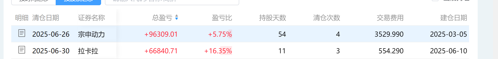

有一两个月没记录股票了，因为忙着很多事情，现在在摩旅的路上，在大理的酒店里面，因为外面下着小雨，没什么地方去，就记录下这两个月的炒股感想，先说结论，很幸运，5月还有20多w的亏损，2个月回本了15w，现在只有5w多点就回本了，主要是宗申动力和拉卡拉两个票吃了一波，下面上截图：

如果够幸运的话，年底应该是能回本的，因为在摩旅，也没什么时间看股票，偶尔买一点，但是总体是盈利的，我现在很少去复盘股票，都是看K线和盘口进行交易，不及预期就走人，是不是大道至简这个意思？
## 大理
顺便记录下大理的感受，昨天骑摩托沿着靠近洱海的一条小村道骑行到喜洲古镇，路上吹着风，看着周围绿油油的草田，虽然是阴天，但是感受还是很不错的，相比大理古城的嘈杂，喜洲还是比较的有文艺气息一些，在这里作一些摄影的工作，养活自己应该是没问题的，虽然同行竞争比较大，但是如果自己想做，应该还是会有很多点可以去突破比他们做的更好的，最近是云南雨季，本来今天要去绕一下洱海，但是外面一直下雨，估计不得行，看看下午吧，还是不得行就在酒店看看视频，休息下，主要是在等快递，今天应该都会到，明天就出发去丽江的白沙古镇，越往西藏新疆走，应该下雨就会少点，这次主要是去新疆看看，看看适不适合长期居住，可能后面还会回来云南，这次的腾冲，西双版纳都没去，因为下雨的缘故，回头再找时间骑行过来，可能会在云南这边长期生活，祝自己身体健康，一切安好。